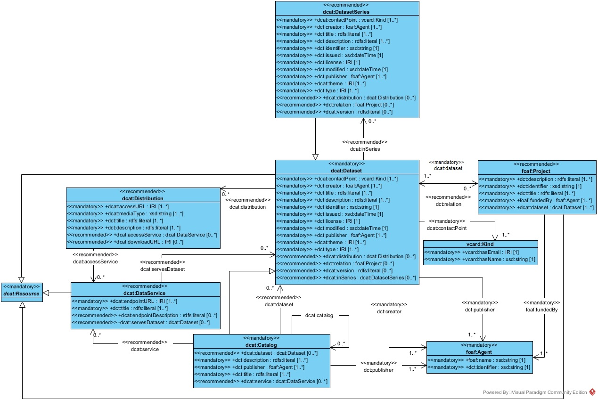

# Core Metadata Schema Specification

## Latest published version
Latest version [available here](https://github.com/Health-RI/health-ri-metadata/releases/tag/v1.0.0)

## Purpose and audience

This repository outlines the Core Metadata Schema, detailing the classes and entities involved and offering usage notes for developers. It addresses the schema's design and application but excludes discussion on the national catalog and its onboarding process. It aims at a technical audience tasked with implementing the metadata schema and stakeholders interested in a detailed understanding of the core schema.

* [Introduction](#introduction)
    * [Scope](#scope)
    * [Mandatory and Recommended](#mandatory-and-recommended)
    * [Terminology](#terminology)
    * [Used Prefixes](#used-prefixes)
    * [Overview and Diagram](#overview-and-diagram)
* [Main Classes](#main-classes)
    * [Mandatory Classes](#mandatory-classes)
    * [Recommended Classes](#recommended-classes)
    * [Abstract Class](#abstract-class)
* [Main Properties per Class](#main-properties-per-class)
    * [Catalog](#catalog)
    * [Dataset](#dataset)
    * [Dataset Series](#dataset-series)
    * [Data Service](#data-service)
    * [Distribution](#distribution)
    * [Agent](#agent)
    * [Kind](#kind)
    * [Cataloged Resource](#cataloged-resource)
* [Feedback, Support, Extension and Implementation](#further-information)

## Introduction

### Scope

To make it easier to share, find and reuse data, the Health-RI nodes decided to list resources in a national directory that can be accessed internationally. They all agreed on what basic information should be included, and that the catalog should be interoperable with other EU portals, which led to the creation of the Core Metadata Schema.

This schema describes the minimum amount of information that should be used to describe resources across Health-RI nodes through the national directory, which is in line with what Plateau 1 offers. The schema can be changed or extended to meet the needs of different areas, and new versions will be released in the future.

### Mandatory and Recommended

Following the [DCAT-AP 3.0](https://semiceu.github.io/DCAT-AP/releases/3.0.0/) specification, we categorize components into `mandatory` and `recommended` classes and properties. A potential third category, `optional`, may be introduced in the future.

In the context of data exchange:

*   **Mandatory** `Class`: Senders **MUST** provide information about instances of the class; Receivers MUST process information about instances of the class.
    
*   **Recommended** `Class`: Senders **SHOULD** provide information about instances of the class if available; Receivers MUST process information about instances of the class.
    
*   **Optional** `Class`: Senders **MAY** provide the information but are not obliged to do so; Receivers MUST process information about instances of the class.
    
*   **Mandatory** `property`: Senders MUST provide the information for that property; Receivers MUST process the information for that property.
    
*   **Recommended** `property`: Senders SHOULD provide the information if available; Receivers MUST process the information for that property.
    
*   **Optional** `property`: Senders MAY provide the information but are not obliged to do so; Receivers MUST process the information for that property.
    

### Terminology

According to [DCAT-AP](https://semiceu.github.io/DCAT-AP/releases/3.0.0/):

*   An **Application Profile** defines the mandatory, recommended, and optional components for a specific use case by leveraging terminology from foundational standards. Additionally, it suggests standardized vocabularies to maintain consistency in the use of terms and data.
    
*   A **Dataset** is a self-contained set of data produced by a specific organization, which can be accessed or downloaded for various uses. A **Data Portal** is an online platform that offers a catalog of datasets and tools to help users locate and utilize these datasets effectively.
    

### Used Prefixes

| **Prefix** | **Namespace IRI** | **Source** |
| --- | --- | --- | 
| `dcat` | `http://www.w3.org/ns/dcat#` | \[[VOCAB-DCAT](https://w3c.github.io/dxwg/dcat/#bib-vocab-dcat "https://w3c.github.io/dxwg/dcat/#bib-vocab-dcat")\] |
| `dct` | `http://purl.org/dc/terms/` | \[[DCT](https://w3c.github.io/dxwg/dcat/#bib-dcterms "https://w3c.github.io/dxwg/dcat/#bib-dcterms")\] |
| `foaf` | `http://xmlns.com/foaf/0.1/` | \[[FOAF](https://w3c.github.io/dxwg/dcat/#bib-foaf "https://w3c.github.io/dxwg/dcat/#bib-foaf")\] |
| `owl` | `http://www.w3.org/2002/07/owl#` | \[[OWL2-SYNTAX](https://w3c.github.io/dxwg/dcat/#bib-owl2-syntax "https://w3c.github.io/dxwg/dcat/#bib-owl2-syntax")\] |
| `rdf` | `http://www.w3.org/1999/02/22-rdf-syntax-ns#` | \[[RDF-SYNTAX-GRAMMAR](https://w3c.github.io/dxwg/dcat/#bib-rdf-syntax-grammar "https://w3c.github.io/dxwg/dcat/#bib-rdf-syntax-grammar")\] |
| `rdfs` | `http://www.w3.org/2000/01/rdf-schema#` | \[[RDF-SCHEMA](https://w3c.github.io/dxwg/dcat/#bib-rdf-schema "https://w3c.github.io/dxwg/dcat/#bib-rdf-schema")\] |
| `skos` | `http://www.w3.org/2004/02/skos/core#` | \[[SKOS-REFERENCE](https://w3c.github.io/dxwg/dcat/#bib-skos-reference "https://w3c.github.io/dxwg/dcat/#bib-skos-reference")\] |
| `time` | `http://www.w3.org/2006/time#` | \[[OWL-TIME](https://w3c.github.io/dxwg/dcat/#bib-owl-time "https://w3c.github.io/dxwg/dcat/#bib-owl-time")\] |
| `xsd` | `http://www.w3.org/2001/XMLSchema#` | \[[XMLSCHEMA11-2](https://w3c.github.io/dxwg/dcat/#bib-xmlschema11-2 "https://w3c.github.io/dxwg/dcat/#bib-xmlschema11-2")\] |
| `vcard` | `http://www.w3.org/2006/vcard/ns#` | \[[VCARD](https://www.w3.org/TR/vcard-rdf/ "https://www.w3.org/TR/vcard-rdf/")\] |

### Overview and Diagram

An overview of the Metadata schema core is presented in the [UML](https://www.omg.org/spec/UML "https://www.omg.org/spec/UML") diagram depicted below. The UML showcases the primary classes (entities), excluding the detailed definitions such as `rdfs:label` and `rdfs:comment`. Each block denotes a class and comprises a list of its attributes (properties). If a class is connected to another class by a closed arrow, indicating that it inherits all properties from the other class. For example, `dcat:DatasetSeries` inherits from `dcat:Dataset` which inherits from `dcat:Resource`. The other arrows, represent relations and contain the type of relation, such as `dcat:Dataset` connects to a `dcat:DatasetSeries` via the predicate `dcat:inSeries`, and include the cardinality, such as `dcat:Dataset` can be connected via `dcat:inSeries` to zero or more `dcat:DatasetSeries`.

- HRI core metadata schema diagram (plateau 1):

## Main Classes

### Mandatory Classes
   
| **Class name** | **Definition** | **Usage Note** | **URI** | **Example** |
| --- | --- | --- | --- | --- |
| [Dataset](#dataset) | A resource type.  A meaningful collection of data, published or curated by a single organisation or individual, and available for access or download in one or more representations. | When focusing on health data, a dataset typically contains structured information gathered from a study or research project related to health topics. This might include clinical trial results, public health statistics, patient records, survey data, etc.   How the data in a dataset can be accessed is defined in the Distribution, which usually points to the actual data files available for access or download. Datasets are often included in a catalog, which organizes and provides metadata about multiple datasets, making them easier to find and use. The term 'organization or individual' refers to any entity responsible for creating, maintaining, or distributing the dataset. | `dcat:Dataset` | Questionnaire data of the Personalised RISk-based MAmmascreening Study (PRISMA),   Clinical data for Inflammatory Bowel Disease (IBD) from AUMC, LUMC and UMCG |
| [Catalog](#catalog) | A catalog that is listed in the National catalog. | Used to describe a bundle of datasets (and other resources) under a single title, for example a collection or a study. | `dcat:Catalog` | NA  |
| [Agent](#agent) | An entity that is associated with catalog and/or Datasets. | A person or organization that is associated with the catalogue and/or datasets. | `foaf:Agent` | NA  |
| [Cataloged Resource](#cataloged-resource) | Resource published or curated by a single agent. | This is an abstract class, we do not use this class, instead we use specifications of it (e.g. Dataset). This is mainly for a high level grouping and the reuse of properties. | `dcat:Resource` | NA  |
| [Kind](#kind) | A description following the vCard specification, e.g. to provide telephone number and e-mail address for a contact point. | Used to describe contact information for Dataset and DatasetSeries. | `vcard:Kind` | NA  |

### Recommended Classes

| **Class name** | **Definition** | **Usage Note** | **URI** |
| --- | --- | --- | --- |   
| [Distribution](#distribution) | An available distribution of the dataset. | Used to describe the different ways that a single dataset can be made available in. I.e., it can be downloaded or it can be accessed online in one or more distributions (e.g. one in a downloadable .csv file, another file with an access or query webpage) | `dcat:Distribution` |
| [Dataset Series](#dataset-series) | A collection of datasets that are published separately, but share some characteristics that group them. | With Dataset Series we refer to data, somehow interrelated, that are published separately. An example is budget data split by year and/or country, instead of being made available in a single dataset. | `dcat:DatasetSeries` |
| [Data Service](#data-service) | A Resource type.   A collection of operations that provides access to one or more datasets or data processing functions. | The kind of service can be indicated using the `dcterms:type` property. Its value may be taken from a controlled vocabulary that should be defined in the community. | `dcat:DataService` |

### _Abstract Class_

_**Cataloged Resource**_ is a generic concept from the DCAT vocabulary, that is rarely used directly, but indirectly through its extensions. We recommend avoiding using `dcat:Resource` directly for your document and requesting a model extension or update, in case the type/class you need is not in this schema.

| **Class name** | **Definition** | **Usage Note** | **URI** |
| --- | --- | --- | --- |   
| [_Cataloged Resource_](#cataloged-resource) | The class resource, everything. | This class is for grouping and class hierarchy relation purposes. | `dcat:Resource` |

## Main Properties per Class

### [Catalog](https://www.w3.org/TR/vocab-dcat-3/#Class:Catalog)

A curated collection of metadata about resources. A web-based data catalog is typically represented as a single instance of this class.

#### Mandatory Properties
   
| **Property name** | **Definition** | **URI** | **rdfs:Range** | **Usage Note** | **Cardinality** | **Example** |
| --- | --- | --- | --- | --- | --- | --- |  
| [title](http://purl.org/dc/terms/title) | A name given to the Catalogue. | `dct:title` | `rdfs:Literal` | A name given to the catalogue. This property can be repeated for providing titles in different languages. This is a required field and needs to be unique. | 1..\* | Inflammatory Bowel Disease catalogue,   Inflammatoire darmziekten catalogus |
| [description](http://purl.org/dc/terms/description) | A free-text account of the record. | `dct:description` | `rdfs:Literal` | A brief informative description of the catalogue. This property can be repeated for descriptions in different languages. | 1..\* | This catalogue describes the core metadata of AUMC Inflammatory Bowel Disease datasets or   This catalogue describes breast cancer imaging, clinical and omics datasets. |
| [publisher](http://purl.org/dc/terms/publisher) | An entity (organisation) responsible for making the Catalogue available. | `dct:publisher` | `foaf:Agent` | The organization that published the catalogue (e.g. the specific UMC in question). In case of a multicenter study, the publisher is the organisation who makes the catalogue available online. To list multiple organisations involved, refer to the "creator" property. | 1 | name: Radboud University Medical Center   identifier: https://ror.org/05wg1m734   (see class foaf: Agent) |
| [contact point](https://www.w3.org/TR/vocab-dcat-3/#Property:resource_contact_point) | Relevant contact information for the Catalogue. | `dcat:contactPoint` | `vcard:Kind` | TBA | 1 | NA |
| [applicable legislation](https://semiceu.github.io/DCAT-AP/r5r/releases/3.0.0/#applicableLegislation) | The legislation that mandates the creation or management of the Catalog. | `dcatap:applicableLegislation` | `eli:LegalResource` | TBA | 1..\* | NA |

#### Recommended Properties
    
| **Property name** | **Definition** | **URI** | **rdfs:Range** | **Usage Note** | **Cardinality** |
| --- | --- | --- | --- | --- | --- | 
| [catalog](https://www.w3.org/TR/vocab-dcat-3/#Property:catalog_catalog) | A catalog that is listed in the catalog. | `dcat:catalog` | `dcat:Catalog` | NA  | 0..\* |
| [dataset](https://www.w3.org/TR/vocab-dcat-3/#Property:catalog_dataset) | relates every catalog to its containing datasets. | `dcat:dataset` | `dcat:Dataset` | The connection to the one or more datasets that this catalog describes. | 0..\* |
| [service](https://www.w3.org/TR/vocab-dcat-3/#Property:catalog_service) | A service that is listed in the catalog. | `dcat:service` | `dcat:DataService` | NA  | 0..\* |
| [creator](https://www.dublincore.org/specifications/dublin-core/dcmi-terms/#creator) | An entity responsible for the creation of the catalogue. | `dct:creator` | `foaf:Agent` | NA  | 0..\* |
| [geographical coverage](http://purl.org/dc/terms/spatial) | A geographical area covered by the Catalogue. | `dct:spatial` | `dct:Location` | NA  | 0..\* |
| [has part](http://purl.org/dc/terms/hasPart) | A related Catalogue that is part of the described Catalogue. | `dct:hasPart` | `dcat:Catalog` | NA  | 0..\* |
| [home page](http://xmlns.com/foaf/spec/#term_homepage) | A web page that acts as the main page for the Catalogue. | `foaf:homepage` | `foaf:Document` | Could be a page describing the catalogue, incl. link to catalogue.  | 0..1 |
| [language](http://purl.org/dc/terms/language) | A language used in the textual metadata describing titles, descriptions, etc. of the Datasets in the Catalogue. | `dct:language` | `dct:LinguisticSystem` | NA  | 0..\* |
| [license](http://purl.org/dc/terms/license) | A licence under which the Catalogue can be used or reused. | `dct:license` | `dct:LicenseDocument` | NA  | 0..1 |
| [modification date](http://purl.org/dc/terms/modified) | The most recent date on which the Catalogue was modified. | `dct:modified` | temporal literal | NA  | 0..1 |
| [record](https://www.w3.org/ns/dcat#record) | A Catalogue Record that is part of the Catalogue. | `dcat:record` | `dcat:CatalogRecord` | NA  | 0..\* |
| [release date](http://purl.org/dc/terms/issued) | The date of formal issuance (e.g., publication) of the Catalogue. | `dct:issued` | temporal literal | NA  | 0..1 |
| [rights](http://purl.org/dc/terms/rights) | A statement that specifies rights associated with the Catalogue. | `dct:rights` | `dct:RightsStatement` | NA  | 0..1 |
| [temporal coverage](http://purl.org/dc/terms/temporal) | A temporal period that the Catalogue covers. | `dct:temporal` | `dct:PeriodOfTime` | NA  | 0..\* |
| [themes](https://www.w3.org/ns/dcat#themeTaxonomy) | A knowledge organisation system used to classify the Catalogue's Datasets. | `dcat:themeTaxanomy` | `skos:ConceptScheme` | This property refers to a knowledge organisation system used to classify the Catalogue's Datasets. It must have at least the value `NAL:data-theme` as this is the mandatory controlled vocabulary for dcat:theme.  | 0..\* |

### [Dataset](https://www.w3.org/TR/vocab-dcat-3/#Class:Dataset)

A meaningful collection of data, published or curated by a single organisation or individual, and available for access or download in one or more representations.

#### Mandatory Properties
 
| **Property name** | **Definition** | **URI** | **rdfs:Range** | **Usage Note** | **Cardinality** | **Example** |
| --- | --- | --- | --- | --- | --- | --- | 
| [contact point](https://www.w3.org/TR/vocab-dcat-3/#Property:resource_contact_point) | Contact information that can be used for sending comments about the Dataset. | `dcat:contactPoint` | `vcard:Kind` | Contact information that can be used, for example, for sending requests for information or access to the dataset. Ideally, a data access committee or other service desk (a contact point that is rather persistent over time). | 1 | mailto: data-access-committee@xumc.nl   with name Data Access Committee of the x UMC (see vcard:Kind) |
| [creator](http://purl.org/dc/terms/creator) | An entity responsible for producing the dataset. | `dct:creator` | `foaf:Agent` | The person or persons responsible for creating the dataset. | 1..\* | Jip Fictief, Inez Maginary, Fabio Abricated for name of foaf:Agent |
| [description](http://purl.org/dc/terms/description) | A free-text account of the Dataset. | `dct:description` | `rdfs:Literal` | A free-text informative description of the dataset. This property can be repeated for providing descriptions in different languages. | 1..\* | The primary aim of the PRISMA study was to investigate the potential value of risk-tailored versus traditional breast cancer screening protocols in the Netherlands. Data collection took place between 2014-2019, resulting in ∼67,000 mammograms, ∼38,000 surveys, ∼10,000 blood samples and ∼600 saliva samples. |
| [identifier](http://purl.org/dc/terms/identifier) | The main identifier for the Dataset, e.g. the URI or other unique identifier in the context of the Catalogue. | `dct:identifier` | `rdfs:Literal` | The main globally unique and persistent identifier of the dataset. Recommended practice is to identify the dataset by means of a string conforming to an identification system such as Digital Object Identifier (DOI). | 1 | https://doi.org/10.34894/ZLOYOJ |
| [publisher](http://purl.org/dc/terms/publisher) | An entity (organisation) responsible for making the Dataset available. | `dct:publisher` | `foaf:Agent` | The organization that published the dataset (e.g. the specific UMC in question). Can differ from catalogue publisher. | 1 | Radboud University Medical Center; identifier https://ror.org/05wg1m734 (see foaf: Agent) |
| [theme](https://www.w3.org/TR/vocab-dcat-3/#Property:resource_theme) | A category of the Dataset. | `dcat:theme` | `skos:Concept` | A Dataset may be associated with multiple themes. The authority table for Data Themes, maintained by the Publications Office of the European Union is the mandatory controlled vocabulary for dcat:theme. It must have at least the value NAL:data-theme "HEAL" to annotate health datasets. | 1..\* | http://publications.europa.eu/resource/authority/data-theme/HEAL |
| [title](http://purl.org/dc/terms/title) | A name given to the Dataset. | `dct:title` | `rdfs:Literal` | A name given to the Dataset. This property can be repeated for providing names in parallel languages. | 1..\* | Questionnaire data of the Personalised RISk-based MAmmascreening Study (PRISMA) |
| [keyword](https://www.w3.org/ns/dcat#keyword) | A keyword or tag describing the Dataset. | `dcat:keyword` | `rdfs:Literal` | NA | 1..\* | NA |
| [access rights](http://purl.org/dc/terms/accessRights) | Information that indicates whether the Dataset is publicly accessible, has access restrictions or is not public. | `dct:accessRights` | [Rights Statement (IRI)](http://publications.europa.eu/resource/authority/access-right) | Information that indicates whether the Dataset is publicly accessible, has access restrictions or is not public. Use one of the following values from [this vocabulary](http://publications.europa.eu/resource/authority/access-right) (:public, :restricted, :non-public). | 1 | `http://publications.europa.eu/resource/authority/access-right/RESTRICTED` |
| [applicable legislation](http://data.europa.eu/r5r/applicableLegislation) | The legislation that mandates the creation or management of the Dataset. | `dcatap:applicableLegislation` | `eli:LegalResource` | For health datasets, the value must include the ELI of the EHDS Regulation. As multiple legislations may apply to the resource the maximum cardinality is not limited. | 1..\* | NA |
| [geographical coverage](http://purl.org/dc/terms/spatial) | A geographic region that is covered by the Dataset. | `dct:spatial` | `dct:Location` | The EU Vocabularies Name Authority Lists must be used for [continents](https://publications.europa.eu/resource/authority/continent), [countries](https://publications.europa.eu/resource/authority/country) and [places](https://publications.europa.eu/resource/authority/place) that are in those lists; if a particular location is not in one of the mentioned Named Authority Lists, [Geonames](https://www.geonames.org/) URIs must be used. | 1..\* | http://publications.europa.eu/resource/authority/place/NLD_AMS |
| [health theme](https://healthdcat-ap.github.io/#Dataset.healththeme) | A category of the Dataset or tag describing the Dataset. | `healthdcatap:healthTheme` | `skos:Concept` | A Dataset may be associated with multiple themes. Wikidata URIs MUST be used. | 1..\* | https://www.wikidata.org/wiki/Q58624061 |
| [number of records](https://healthdcat-ap.github.io/#Dataset.numberofrecords) | Size of the dataset in terms of the number of records. | `healthdcatap:numberOfRecords` | `xsd:NonNegativeInteger` | NA | 1 | NA |

#### Recommended Properties

| **Property name** | **Definition** | **URI** | **rdfs:Range** | **Usage Note** | **Cardinality** | **Example** |
| --- | --- | --- | --- | --- | --- | --- |    
| [type](http://purl.org/dc/terms/type) | A type of the Dataset. | `dct:type` | `skos:Concept` | A recommended controlled vocabulary data-type is foreseen. For health datasets containing personal level information, the type of the dataset MUST take the value "personal data". This list of terms provide types of datasets. Its main scope is to support dataset categorisation of the EU Open Data Portal. (To create a new entry for PERSONAL_DATA) | 0..\* | http://purl.org/dc/dcmitype/MovingImage |
| [in series](https://www.w3.org/TR/vocab-dcat-3/#Property:dataset_in_series) | A dataset series of which the dataset is part. | `dcat:inSeries` | `dcat:DatasetSeries` | NA  | 0..\* | NA  |
| [distribution](https://www.w3.org/TR/vocab-dcat-3/#Property:dataset_distribution) | An available distribution of the dataset. | `dcat:distribution` | `dcat:Distribution` | Use this property to point to the distribution of this dataset when a distribution is available. For non-open health datasets, a distribution must include information on the [Health Data Access Body](https://healthdcat-ap.github.io/#hdabs) supporting data access. | 0..\* | NA  |
| [temporal coverage](http://purl.org/dc/terms/temporal) | A temporal period that the Dataset covers. | `dct:temporal` | `dct:PeriodOfTime` | NA  | 0..\* |
| [temporal resolution](https://www.w3.org/TR/vocab-dcat-3/#Property:dataset_temporal_resolution) | The minimum time period resolvable in the dataset. | `dcat:temporalResolution` | `xsd:duration` | NA  | 0..1 |
| [modification date](http://purl.org/dc/terms/modified) | The most recent date on which the Dataset was changed or modified. | `dct:modified` | `xsd:dateTime` | The value indicates a change to the actual dataset, not a change to the catalog record. An absent value may indicate that the resource has never changed after its initial publication, or that the date of last modification is not known, or that the resource is continuously updated. | 0..1 | 2024-06-04T13:36:10.246Z |
| [release date](https://www.dublincore.org/specifications/dublin-core/dcmi-terms/terms/issued/) |The date of formal issuance (e.g., publication) of the Dataset. | `dct:issued` | `xsd:dateTime` | The date and time when the dataset was first issued. | 0..1 | 2024-06-04T13:36:10.246Z |
| [version](https://www.w3.org/TR/vocab-dcat-3/#Property:resource_version) | The version indicator (name or identifier) of a resource. | `dcat:version` | `rdfs:Literal` | NA  | 0..1 | NA  |
| [has version](https://www.w3.org/TR/vocab-dcat-3/#Property:resource_has_version) | A related Dataset that is a version, edition, or adaptation of the described Dataset. | `dcat:hasVersion` | `dcat:Dataset` | NA  | 0..\* | NA  |
| [language](http://purl.org/dc/terms/language) | A language of the Dataset. | `dct:language` | `dct:LinguisticSystem` | A language from the following vocabulary: https://publications.europa.eu/resource/authority/language | 0..\* | http://publications.europa.eu/resource/authority/language/NLD |
| [minimum typical age](https://healthdcat-ap.github.io/#Dataset.mintypicalage) | Minimum typical age of the population within the dataset. | `healthdcatap:minTypicalAge` | `xsd:non NegativeInteger ` | NA  | 0..1 | NA  |
| [maximum typical age](https://healthdcat-ap.github.io/#Dataset.maxtypicalage) | Maximum typical age of the population within the dataset | `healthdcatap:maxTypicalAge` | `xsd:non NegativeInteger ` | NA  | 0..1 | NA  |
| [publisher note](https://healthdcat-ap.github.io/#Dataset.publishernote) | A description of the publisher activities. | `healthdcatap:publishernote` | `rdfs:Literal ` | NA  | 0..1 | NA  |
| [publisher type](https://healthdcat-ap.github.io/#Dataset.publishernote) | A type of organisation that makes the Dataset available. | `healthdcatap:publishertype` | `skos:Concept ` | A [controlled vocabulary](https://raw.githubusercontent.com/SEMICeu/ADMS-AP/master/purl.org/ADMS_SKOS_v1.00.rdf) is provided, denoting commonly recognised health publishers.  | 0..1 | http://purl.org/adms/publishertype/NonGovernmentalOrganisation  |
| [purpose](https://w3c.github.io/dpv/2.0/dpv/#dfn-haspurpose) | A free text statement of the purpose of the processing of data or personal data. | `dpv:hasPurpose` | `dpv:Purpose` | NA  | 0..\* | NA  |
| [analytics](https://healthdcat-ap.github.io/#Dataset.analytics) | An analytics distribution of the dataset. | `healthdcatap:analytics` | `dcat:Distribution` | Publishers are encouraged to provide URLs pointing to API endpoints or document repositories where users can access or request associated resources such as technical reports of the dataset, quality measurements, usability indicators,... or analytics services.  | 0..\* | NA  |
| [code values](https://healthdcat-ap.github.io/#Dataset.hascodevalues) | Health classifications and their codes associated with the dataset. | `healthdcatap:hasCodeValues` | `skos:Concept` | A dataset may be associated with multiple health classifications.  | 0..\* | NA  |
| [coding system](https://healthdcat-ap.github.io/#Dataset.hascodingsystem) | Coding systems in use (ex: ICD-10-CM, DGRs, SNOMED=CT, ...). | `healthdcatap:hasCodingSystem` | `dct:Standard (IRI)` | Wikidata URIs MUST be used.  | 0..\* | NA  |
| [conforms to](http://purl.org/dc/terms/conformsTo) | An implementing rule or other specification. | `dct:conformsTo` | `dct:Standard (IRI)` | Wikidata URIs MUST be used.  | 0..\* | NA  |
| [documentation](http://xmlns.com/foaf/spec/#term_page) | A page or document about this Dataset. | `foaf:page` | `foaf:Document (IRI)` | NA | 0..\* | NA |
| [frequency](http://purl.org/dc/terms/accrualPeriodicity) | The frequency at which the Dataset is updated. | `dct:accrualPeriodicity` | `skos:Concept` | A resource from the following authoroty table must be used: http://publications.europa.eu/resource/authority/frequency  | 0..1 | http://publications.europa.eu/resource/authority/frequency/ANNUAL |
| [legal basis](https://healthdcat-ap.github.io/#Dataset.haslegalbasis) | The legal basis used to justify processing of personal data. | `dpv:hasLegalBasis` | `dpv:LegalBasis` | NA  | 0..\*| NA |
| [number of unique infividuals](https://healthdcat-ap.github.io/#Dataset.numberofuniqueindividuals) | Number of records for unique individuals. | `healthdcatap:numberOfUniqueIndividuals` | `xsd:NonNegativeInteger` | NA  | 0..1 | NA |
| [other identifier](https://healthdcat-ap.github.io/#Dataset.otheridentifier) | A secondary identifier of the Dataset, such as MAST/ADS17, DataCite18, DOI19, EZID20 or W3ID21. | `adms:identifier` | `adms:Identifier` | NA  | 0..\* | NA |
| [personal data](https://healthdcat-ap.github.io/#Dataset.haspersonaldata) | Key elements that represent an individual in the dataset. | `dpv:hasPersonalData` | `dpv:PersonalData` | https://w3c.github.io/dpv/2.0/pd/  | 0..\* | NA |
| [population coverage](https://healthdcat-ap.github.io/#Dataset.populationcoverage) | A definition of the population within the dataset. | `healthdcatap:populationCoverage` | `rdfs:Literal` | NA | 0..\* | NA |
| [qualified attribution](https://www.w3.org/TR/prov-o/#qualifiedAttribution) | An Agent having some form of responsibility for the resource. | `prov:qualifiedAttribution` | `prov:Attribution` | NA | 0..\* | NA |
| [quality annotation](https://www.w3.org/TR/vocab-dqv/#dqv:hasQualityAnnotation) | A statement related to quality of the Dataset, including rating, quality certificate, feedback that can be associated to the dataset. | `dqv:hasQualityAnnotation` | `dqv:qualityCertificate` | NA | 0..\* | NA |
| [retention period](https://healthdcat-ap.github.io/#Dataset.retentionperiod) | A temporal period which the dataset is available for secondary use. | `healthdcatap:retentionperiod` | `dct:PeriodOfTime` | NA | 0..\* | NA |
| [sample](https://healthdcat-ap.github.io/#Dataset.sample) | A sample distribution of the dataset. | `adms:sample` | `dcat:Distribution` | NA | 0..\* | NA |
| [source](http://purl.org/dc/terms/source) | A related dataset from which the described dataset is derived. | `dct:source` | `dcat:Dataset` | NA | 0..\* | NA |
| [version notes](https://www.w3.org/ns/legacy_adms#versionNotes) | A description of the differences between this version and a previous version of the Dataset. | `adms:versionnotes` | `rdfs:Literal` | This property can be repeated for parallel language versions of the version notes. | 0..\* | NA |
| [was generated by](https://www.w3.org/TR/prov-o/#wasGeneratedBy) | An activity that generated, or provides the business context for, the creation of the dataset. | `prov:wasGeneratedBy` | `prov:Activity` | NA | 0..\* | NA |
| [status](https://www.w3.org/TR/prov-o/#wasGeneratedBy) | The status of a dataset. | `adms:status` | `skos:Concept` | A resource from the authoroty table must be used https://publications.europa.eu/resource/authority/dataset-status | 0..\* | http://publications.europa.eu/resource/authority/dataset-status/COMPLETED |
| [is referenced by](http://purl.org/dc/terms/isReferencedBy) | A related resource, such as a publication, that references, cites, or otherwise points to the dataset. | `dct:isReferencedBy` | `rdfs:Resource` | NA | NA | NA |
| [relation](http://purl.org/dc/terms/relation) | NA | `dct:relation` | `rdfs:Resource` | NA | NA | NA |
| [qualified relation](https://semiceu.github.io/DCAT-AP/releases/3.0.0/#Dataset.qualifiedrelation) | A description of a relationship with another resource. | `dcat:qualifiedRelation` | `dcat:Relationship` | NA | 0..\* | NA |

### [Dataset Series](https://www.w3.org/TR/vocab-dcat-3/#Class:Dataset_Series)

#### Mandatory Properties
  
| **Property name** | **Definition** | **URI** | **rdfs:Range** | **Usage Note** | **Cardinality** | **Example** |
| --- | --- | --- | --- | --- | --- | --- |   
| [contact point](https://www.w3.org/TR/vocab-dcat-3/#Property:resource_contact_point) | Relevant contact information for the catalog resource. | `dcat:contactPoint` | `vcard:Kind` | Contact information that can be used for sending comments about the Dataset Series. Ideally, a data access committee or other service desk (a contact point that is rather persistent over time). | 1..\* | mailto: data-access-committee@xumc.nl   with name Data Access Committee of the x UMC (see vcard:Kind) |
| [creator](http://purl.org/dc/terms/creator) | The entity responsible for producing the resource. | `dct:creator` | `foaf:Agent` | The person or persons responsible for creating the dataset. | 1..\* | Jip Fictief, Inez Maginary, Fabio Abricated for name of foaf:Agent |
| [description](http://purl.org/dc/terms/description) | A free-text account of the record | `dct:description` | `rdfs:Literal` | A free-text informative description of the dataset. This property can be repeated for providing descriptions in different languages. | 1..\* | The primary aim of the PRISMA study was to investigate the potential value of risk-tailored versus traditional breast cancer screening protocols in the Netherlands. Data collection took place between 2014-2019, resulting in ∼67,000 mammograms, ∼38,000 surveys, ∼10,000 blood samples and ∼600 saliva samples. |
| [issued](https://www.dublincore.org/specifications/dublin-core/dcmi-terms/terms/issued/) | Date of formal issuance (e.g., publication) of the resource. | `dct:issued` | `xsd:dateTime` | The date and time when the dataset was first issued. | 1..1 | 2024-06-04T13:36:10.246Z |
| [identifier](http://purl.org/dc/terms/identifier) | A unique identifier of the resource being described or catalogued. | `dct:identifier` | `xsd:string` | The main globally unique and persistent identifier of the dataset. Recommended practice is to identify the dataset by means of a string conforming to an identification system such as Digital Object Identifier (DOI). | 1..1 | https://doi.org/10.34894/ZLOYOJ |
| [modified](http://purl.org/dc/terms/modified) | Most recent date on which the catalog entry was changed, updated or modified. | `dct:modified` | `xsd:dateTime` | The value indicates a change to the actual dataset, not a change to the catalog record. An absent value may indicate that the resource has never changed after its initial publication, or that the date of last modification is not known, or that the resource is continuously updated. | 1..1 | 2024-06-04T13:36:10.246Z |
| [publisher](http://purl.org/dc/terms/publisher) | The entity responsible for making the resource available. | `dct:publisher` | `foaf:Agent` | The organization that published the dataset (e.g. the specific UMC in question). Can differ from catalogue publisher. | 1..\* | Radboud University Medical Center; identifier https://ror.org/05wg1m734 (see foaf: Agent) |
| [theme](https://www.w3.org/TR/vocab-dcat-3/#Property:resource_theme) | A main category of the resource. A resource can have multiple themes. | `dcat:theme` | `IRI` | Consists of 1 or more IRIs (links) separated by commas. When set, it specifies relevant ontology concepts that classify the dataset. Typically, these can be looked up using the Ontology Lookup Service (OLS) or Bioportal | 1..\* | http://publications.europa.eu/resource/authority/data-theme/HEAL |
| [title](http://purl.org/dc/terms/title) | A name given to the record. | `dct:title` | `rdfs:Literal` | A name given to the Dataset. This property can be repeated for providing names in parallel languages. | 1..\* | Questionnaire data of the Personalised RISk-based MAmmascreening Study (PRISMA) |
| [license](http://purl.org/dc/terms/license) | A legal document under which the resource is made available. | `dct:license` | `IRI` | This should contain a URL that provides details regarding the license that is applicable to this dataset (open data commons, data access policy link etc.) | 1..1 | NA  |

#### Recommended Properties
  
| **Property name** | **Definition** | **URI** | **rdfs:Range** | **Usage Note** | **Cardinality** | **Example** |
| --- | --- | --- | --- | --- | --- | --- |   
| [distribution](https://www.w3.org/TR/vocab-dcat-3/#Property:dataset_distribution) | An available distribution of the dataset. | `dcat:distribution` | `dcat:Distribution` | Use this property to point to the distribution of this dataset when a distribution is available. | 0..\* | NA  |
| [type](http://purl.org/dc/terms/type) | The nature or genre of the resource. | `dct:type` | `IRI` | The value SHOULD be taken from a well governed and broadly recognised controlled vocabulary, such as [DCMI Type vocabulary](https://www.dublincore.org/specifications/dublin-core/dcmi-terms/#DCMIType) | 0..\* | http://purl.org/dc/dcmitype/MovingImage |
| [version](https://www.w3.org/TR/vocab-dcat-3/#Property:resource_version) | The version indicator (name or identifier) of a resource. | `dcat:version` | `rdfs:Literal` | NA  | 0..\* | NA  |
| [in series](https://www.w3.org/TR/vocab-dcat-3/#Property:dataset_in_series) | A dataset series of which the dataset is part. | `dcat:inSeries` | `dcat:DatasetSeries` | NA  | 0..\* | NA  |

### [Data Service](http://www.w3.org/ns/dcat#DataService)
---------------------------------------------------------------------------------------------

A collection of operations that provides access to one or more datasets or data processing functions.

#### Mandatory Properties
  
| **Property name** | **Definition** | **URI** | **rdfs:Range** | **Usage Note** | **Cardinality** | **Example** |
| --- | --- | --- | --- | --- | --- | --- |
| [end point URL](https://www.w3.org/TR/vocab-dcat-3/#Property:data_service_endpoint_url) | The root location or primary endpoint of the service (a Web-resolvable IRI). | `dcat:endPointURL` | `IRI` | NA  | 1 | NA |
| [title](http://purl.org/dc/terms/title) | A name given to the Data Service. | `dct:title` | `rdfs:Literal` | NA  | 1..\* | NA |
| [access rights](http://purl.org/dc/terms/accessRights) | Information regarding access or restrictions based on privacy, security, or other policies. | `dct:accessRights` | [Rights Statement (IRI)](http://publications.europa.eu/resource/authority/access-right) | Information that indicates whether the Dataset is publicly accessible, has access restrictions or is not public. Use one of the following values from [this vocabulary](http://publications.europa.eu/resource/authority/access-right) (:public, :restricted, :non-public). | 1 | `http://publications.europa.eu/resource/authority/access-right/RESTRICTED` |
| [contact point](https://www.w3.org/TR/vocab-dcat-3/#Property:resource_contact_point) | Contact information that can be used for sending comments about the Data Service. | `dcat:contactPoint` | `vcard:Kind` | NA | 1 | mailto: data-access-committee@xumc.nl   with name Data Access Committee of the x UMC (see vcard:Kind) |
| [description](http://purl.org/dc/terms/description) | A free-text account of the Data Service. | `dct:description` | `rdfs:Literal` | A free-text informative description of the data service. This property can be repeated for providing descriptions in different languages. | 1..\* | NA |
| [identifier](http://purl.org/dc/terms/identifier) | A unique identifier of the resource being described or catalogued. | `dct:identifier` | `rdfs:Literal` | NA | 1 | NA |
| [license](http://purl.org/dc/terms/license) | A licence under which the Data service is made available. | `dct:license` | `dct:LicenseDocument` | NA | 1 | NA  |
| [publisher](http://purl.org/dc/terms/publisher) | An entity (organisation) responsible for making the Data Service available. | `dct:publisher` | `foaf:Agent` | NA | 1 | name: Radboud University Medical Center   identifier: https://ror.org/05wg1m734   (see class foaf: Agent) |
| [theme](https://www.w3.org/TR/vocab-dcat-3/#Property:resource_theme) | A category of the Data Service. | `dcat:theme` | `skos:Concept` | A Data Service may be associated with multiple themes. | 1..\* | NA |

#### Recommended Properties

| **Property name** | **Definition** | **URI** | **rdfs:Range** | **Usage Note** | **Cardinality** |
| --- | --- | --- | --- | --- | --- |  
| [end point description](https://www.w3.org/TR/vocab-dcat-3/#Property:data_service_endpoint_description) | A description of the services available via the end-points, including their operations, parameters etc. | `dcat:endpointDescription` | `rdfs:Literal` | The property gives specific details of the actual endpoint instances, while dct:conformsTo is used to indicate the general standard or specification that the endpoints implement. | 0..\* |
| [serves dataset](https://www.w3.org/TR/vocab-dcat-3/#Property:data_service_serves_dataset) | This property refers to a collection of data that this data service can distribute. | `dcat:servesDataset` | `dcat:Dataset` | NA  | 0..\* |
| [appication profile](http://purl.org/dc/terms/conformsTo) | An established (technical) standard to which the Data Service conforms. | `dct:conformsTo` | `dct:Standard` | The standards referred here SHOULD describe the Data Service and not the data it serves. The latter is provided by the dataset with which this Data Service is connected. For instance the data service adheres to the OGC WFS API standard, while the associated dataset adheres to the INSPIRE Address data model.  | 0..\* | 
| [appication profile](http://purl.org/dc/terms/conformsTo) | An established (technical) standard to which the Data Service conforms. | `dct:conformsTo` | `dct:Standard` | The standards referred here SHOULD describe the Data Service and not the data it serves. The latter is provided by the dataset with which this Data Service is connected. For instance the data service adheres to the OGC WFS API standard, while the associated dataset adheres to the INSPIRE Address data model.  | 0..\* | 
| [creator](http://purl.org/dc/terms/creator) | The entity responsible for producing the resource. | `dct:creator` | `vcard:Kind` | NA | 0..\* | 
| [format](http://purl.org/dc/terms/format) | The structure that can be returned by querying the endpointURL. | `dct:format` | `dct:MediaType or Extent` | Use the term from the authority table: https://publications.europa.eu/resource/authority/file-type | 0..\* | 
| [HVD Category](https://semiceu.github.io/DCAT-AP/r5r/releases/3.0.0/#hvdCategory) | A data category defined in the High Value Dataset Implementing Regulation. | `dcatap:hvdCategory` | `skos:Concept` | For the possible values consult the regulation at http://data.europa.eu/eli/reg_impl/2023/138/oj. Or consulted the controlled vocabulary derived from it. | 0..\* | 
| [keyword](https://www.w3.org/ns/dcat#keyword) | A keyword or tag describing the Data Service. | `dcat:keyword` | `rdfs:Literal` | NA | 0..\* |
| [landing page](https://www.w3.org/TR/vocab-dcat-3/#Property:resource_landing_page) | A web page that provides access to the Data Service and/or additional information. | `dcat:landingPage` | `foaf:Document` | It is intended to point to a landing page at the original data service provider, not to a page on a site of a third party, such as an aggregator. | 0..\* |
| [language](http://purl.org/dc/terms/language) | A language of the Data Service. | `dct:language` | `dct:LinguisticSystem` | A language from the following vocabulary: https://publications.europa.eu/resource/authority/language | 0..\* | 
| [modification date](http://purl.org/dc/terms/modified) | Most recent date on which the catalog entry was changed, updated or modified. | `dct:modified` | `xsd:dateTime` | NA | 0..1 |
| [other identifier](https://docs.geostandaarden.nl/dcat/dcat-ap-nl30/#dataservice-other-identifier) | Any other identifiers in addition to the identifier. | `adms:identifier` | `adms:Identifier` | NA | 0..\* |
| [rights](http://purl.org/dc/terms/rights) | A statement that specifies rights associated with the Data Service. | `dct:rights` | `dct:RightsStatement` | NA  | 0..\* | 
| [applicable legislation](https://semiceu.github.io/DCAT-AP/r5r/releases/3.0.0/#applicableLegislation) | The legislation that mandates the creation or management of the Data Service. | `dcatap:applicableLegislation` | `eli:LegalResource` | TBA | 0..\* | NA |

### [Distribution](http://www.w3.org/ns/dcat#Distribution)

An available distribution of the dataset.

#### Mandatory Properties

| **Property name** | **Definition** | **URI** | **rdfs:Range** | **Usage Note** | **Cardinality** | **Example** |
| --- | --- | --- | --- | --- | --- | --- |  
| [access URL](https://www.w3.org/TR/vocab-dcat-3/#Property:distribution_access_url) | A URL that gives access to a Distribution of the Dataset. | `dcat:accessURL` | `IRI` | This property contains a URL that gives access to a Distribution of the Dataset. The resource at the access URL may contain information about how to get the Dataset. | 1 | NA  |
| [license](http://purl.org/dc/terms/license) | A licence under which the Distribution is made available. | `dct:license` | `dct:LicenseDocument` | This should contain a URL that provides details regarding the license that is applicable to this dataset (open data commons, data access policy link etc.) | 1 | NA  |
| [applicable legislation](https://semiceu.github.io/DCAT-AP/r5r/releases/3.0.0/#applicableLegislation) | The legislation that mandates the creation or management of the Distribution. | `dcatap:applicableLegislation` | `eli:LegalResource` | TBA | 1..\* | NA |

#### Recommended Properties

| **Property name** | **Definition** | **URI** | **rdfs:Range** | **Usage Note** | **Cardinality** |  **Example** |
| --- | --- | --- | --- | --- | --- | --- |
| [access service](https://www.w3.org/TR/vocab-dcat-3/#Property:distribution_access_service) | A data service that gives access to the distribution of the dataset | `dcat:accessService` | `dcat:DataService` | `dcat:accessService` _SHOULD_ be used to link to a description of a `dcat:DataService` that can provide access to this distribution. | 0..1 | NA |
| [byte size](https://semiceu.github.io/DCAT-AP/releases/3.0.0/#Distribution.bytesize) | The size of a Distribution in bytes. | `dcat:byteSize` | `xsd:nonNegativeInteger` | NA  | 0..1 | NA  |
| [description](http://purl.org/dc/terms/description) | A free-text account of the distribution. | `dct:description` | `rdfs:Literal` | This property can be repeated for parallel language versions of the description.  | 0..\* | NA  |
| [title](http://purl.org/dc/terms/title) | A name given to the Distribution. | `dct:title` | `rdfs:Literal` | This property can be repeated for providing names in parallel languages. | 0..\* | NA |
| [description](http://purl.org/dc/terms/description) | A free-text account of the Distribution. | `dct:description` | `rdfs:Literal` | This property can be repeated for parallel language versions of the description. | 0..\* | NA |
| [download URL](https://www.w3.org/TR/vocab-dcat-3/#Property:distribution_download_url) | The URL of the downloadable file in a given format. E.g., CSV file or RDF file. The format is indicated by the distribution's `dcterms:format` and/or `dcat:mediaType` | `dcat:downloadURL` | `IRI` | NA  | 0..1 | NA |
| [media type](https://www.w3.org/TR/vocab-dcat-3/#Property:distribution_media_type) | The media type of the distribution as defined by IANA \[[IANA-MEDIA-TYPES](https://www.w3.org/TR/vocab-dcat-3/#bib-iana-media-types)\]. | `dcat:mediaType` | `IRI` | This property _SHOULD_ be used when the media type of the distribution is defined in IANA \[[IANA-MEDIA-TYPES](https://www.w3.org/TR/vocab-dcat-3/#bib-iana-media-types)\], otherwise `dcterms:format` _MAY_ be used with different values. | 0..1 | https://www.iana.org/assignments/media-types/text/csv |
| [release date](http://purl.org/dc/terms/issued) | The date of formal issuance (e.g., publication) of the Distribution. | `dct:issued` | `xsd:dateTime` | NA  | 0..1 | NA |
| [rights](http://purl.org/dc/terms/rights) | A statement that specifies rights associated with the Distribution. | `dct:rights` | `dct:RightsStatement` | A statement that concerns all rights not addressed in fields License or Rights, such as copyright statements. Everything that is not covered with licece  | 0..1 | NA |
| [temporal resolution](https://semiceu.github.io/DCAT-AP/releases/3.0.0/#Distribution.temporalresolution) | The minimum time period resolvable in the dataset distribution.| `dcat:temporalResolution` | `xsd:duration` | NA | 0..1 | NA |
| [retention period](https://healthdcat-ap.github.io/#Dataset.retentionperiod) | The minimum time period resolvable in the dataset distribution.| `healthdcatap:retentionperiod` | `dct:PeriodOfTime` | NA | 0..\* | NA |
| [checksum](https://spdx.org/rdf/spdx-terms-v2.2/#d4e1930) | A mechanism that can be used to verify that the contents of a distribution have not changed.| `spdx:checksum` | `spdx:Checksum` | The checksum is related to the downloadURL. | 0..1 | NA |
| [compression format](https://semiceu.github.io/DCAT-AP/releases/3.0.0/#Distribution.compressionformat) | The format of the file in which the data is contained in a compressed form, e.g. to reduce the size of the downloadable file. | `dcat:compressFormat` | `dct:MediaType` | It SHOULD be expressed using a media type as defined in the official register of media types managed by [IANA](https://www.iana.org/assignments/media-types/media-types.xhtml). | 0..1 | NA |
| [documentation](http://xmlns.com/foaf/spec/#term_page) | A page or document about this Distribution. | `foaf:page` | `foaf:Document (IRI)` | NA | 0..\* | NA |
| [linked schemas](http://purl.org/dc/terms/conformsTo) | An established schema to which the described Distribution conforms. | `dct:conformsTo` | `dct:Standard (IRI)` | NA | 0..\* | NA |
| [format](http://purl.org/dc/terms/format) | The file format of the Distribution. | `dct:format` | `dct:MediaType or Extent` | Use the term from the authority table: https://publications.europa.eu/resource/authority/file-type | 0..1 | http://publications.europa.eu/resource/authority/file-type/TSV |
| [language](http://purl.org/dc/terms/language) | A language used in the Distribution. | `dct:language` | `dct:LinguisticSystem (IRI)` | This property can be repeated if the metadata is provided in multiple languages. Use a term from the authority table: http://publications.europa.eu/resource/authority/language | 0..\* | NA |
| [packaging format](https://semiceu.github.io/DCAT-AP/releases/3.0.0/#Distribution.packagingformat) | The format of the file in which one or more data files are grouped together, e.g. to enable a set of related files to be downloaded together. | `dcat:packageFormat` | `dct:MediaType` | It SHOULD be expressed using a media type as defined in the official register of media types managed by [IANA](https://www.iana.org/assignments/media-types/media-types.xhtml). | 0..1 | NA |
| [modification date](http://purl.org/dc/terms/modified) | The most recent date on which the Distribution was changed or modified. | `dct:modified` | `xsd:dateTime` | NA | 0..1 | NA |
| [status](https://www.w3.org/ns/legacy_adms#status) | The status of the distribution in the context of maturity lifecycle. | `adms:status` | `skos:Concept` | It MUST take one of the values Completed, Deprecated, Under Development, Withdrawn. Use a term from the authoroty table: https://publications.europa.eu/resource/authority/distribution-status | 0..1 | NA |

### [Agent](http://xmlns.com/foaf/spec/#term_Agent)

An entity that is associated with catalog and/or Datasets. Agent can be individuals or organisations, If the Agent is an organisation, the use of the Organization Ontology is recommended.

#### Mandatory Properties

| **Property name** | **Definition** | **URI** | **rdfs:Range** | **Usage Note** | **Cardinality** |
| --- | --- | --- | --- | --- | --- |   
| [name](http://xmlns.com/foaf/spec/#term_name) | A name of the agent. | `foaf:name` | `rdfs:Literal` | This property contains a name of the agent. This property can be repeated for different versions of the name (e.g. the name in different languages) | 1..\* |
| [identifier](http://purl.org/dc/terms/identifier) | A unique identifier of the agent. | `dct:identifier` | `rdfs:Literal` |   A unique identifier of a person or organisation being described, like [ORCID](https://orcid.org) for a researcher or [ROR](https://ror.org) for an organization.  | 1..1 |

#### Recommended Properties

| **Property name** | **Definition** | **URI** | **rdfs:Range** | **Usage Note** | **Cardinality** |
| --- | --- | --- | --- | --- | --- |   
| [type](http://purl.org/dc/terms/type) | A type of the agent that makes the Catalogue or Dataset available. | `dct:type` | `skos:Concept` | Property should be described using [ADMS vocabulary](http://purl.org/adms/publishertype/1.0) | 0..1 |
| [URL](http://xmlns.com/foaf/spec/#term_homepage) | A webpage that either allows to make contact (i.e. a webform) or the information contains how to get into contact. | `foaf:homepage` | `rdfs:Resource` | NA | 0..1 |
| [email](http://xmlns.com/foaf/spec/#term_mbox) | A email address via which contact can be made. This property SHOULD be used to provide the email address of the Agent, specified using fully qualified mailto: URI scheme [RFC6068]. The email SHOULD be used to establish a communication channel to the agent. | `foaf:mbox` | `rdfs:Resource` | NA | 0..\* |
| [country](http://purl.org/dc/terms/spatial) | Country of the agent. | `dct:spatial` | `dct:Location` | Point to the country code URL from [Geonames](https://www.geonames.org/). | 0..\* | http://publications.europa.eu/resource/authority/place/NLD_AMS |

### Kind

Contact information of the contact point for Dataset and DatasetSeries.

#### Mandatory Properties

| **Property name** | **Definition** | **URI** | **rdfs:Range** | **Usage Note** | **Cardinality** |
| --- | --- | --- | --- | --- | --- | 
| [formatted name](https://w3.org/TR/vcard-rdf/#d4e891) | The full name of the object | `vcard:fn` | `xsd:string` | NA  | 1 |
| [has email](https://www.w3.org/TR/vcard-rdf/#d4e183) | A email address via which contact can be made. | `vcard:hasEmail` | `rdfs:Resource` | NA  | 1   |

#### Recommended Properties

| **Property name** | **Definition** | **URI** | **rdfs:Range** | **Usage Note** | **Cardinality** |
| --- | --- | --- | --- | --- | --- | 
| [contact page](https://www.w3.org/TR/vcard-rdf/#d4e605) | A webpage that either allows to make contact (i.e. a webform) or the information contains how to get into contact. | `vcard:hasURL` | `rdfs:Resource` | NA  | 0..\* |

### Cataloged Resource

All things described by RDF are called _resources_, and they are instances of the class `dcat:Resource`. This is the class of everything. All other classes are [subclasses](https://www.w3.org/TR/rdf12-schema/#def-subclass) of this class. To read more, go to

## Further Information

### Model extension

Within DCAT and DCAT-AP, the term "resource" generally encompasses all objects that can be described using [RDF](https://www.w3.org/RDF/). However, there are specific categories and attributes used to indicate the different types of resources:

*   `dcat:Dataset` is a type of `dcat:Resource` representing a collection of data
    
*   `dcat:Distribution` is a type of `dcat:Resourcee` representing an available form or representation of a dataset.
    
*   `dcat:Catalog` is a type of `dcat:Resource` representing a collection of datasets.
    
*   `dcat:DataService` , introduced in DCAT version 2, is a type of Resource representing a service for accessing data.
    

In DCAT and DCAT-AP, the vocabulary is focused on datasets. Nonetheless, users may need to portray a variety of resources specific to certain domains, like biobanks or patient registries. In such cases, we propose potential scenarios for modifying or augmenting DCAT to accurately depict your resource type:

*   **Use** `dcat:Resource` **directly**: If the asset you are dealing with is not in line with the `dcat:Dataset` definition, you can use the broader term `dcat:Resource`. This term allows you to represent almost any type of asset. However, this approach may not be completely clear for users who are trying to understand the essence of the asset. We can de define the asset type further with specific vocabularies over time.
    
*   **Expand with Personalised Classes**: If there is a need to represent specific resources, such as biobanks or patient registries, it may be beneficial to supplement the foundational DCAT vocabulary with custom classes. For example:
    

`:Collection a rdfs:Class ;`

`rdfs:subClassOf dcat:Resource .`

and

`:PatientRegistry a rdfs:Class ;`

`rdfs:subClassOf dcat:Dataset .`

When creating custom classes, it is essential to provide detailed metadata for each type of resource. This will enable users and systems to distinguish between them and comprehend their subtle differences. For instance, consider the distinction between a collection and a dataset. Therefore, it is crucial to provide specific and unambiguous information to ensure complete understanding.

### Notes on Alignment

To create the current core metadata schema, we examined existing metadata from the [COVID-19 national portal](https://covid19initiatives.health-ri.nl/), metadata schema provided by Health-RI nodes (e.g., [ABC metadata](https://github.com/AmsterdamUMC/ABC-metadata-project)), and standards used in portals across Europe and beyond (e.g., W3C, DCAT, DCAT-AP). With the help of metadata specialists, we mapped their classes and properties and decided to reuse DCAT and DCAT-AP for implementation. The Core metadata schema includes DCAT v3 and selected DCAT-AP mandatory classes, ensuring compatibility with international catalogs. DCAT-AP covers the identified requirements for exchanging information about datasets and services in Europe. Alignment with DCAT NL is under development.

### Implementation

The model is part of the requirements to onboard to the Health-RI catalog. Users can start the onboarding process by publishing their metadata according to this schema in a FAIR Data Point. To start:
- read the explanation of all classes and properties above,
- collect and map your metadata instances to the model using this [example metadata collection sheet](https://github.com/Health-RI/health-ri-metadata/blob/master/Implementation/metadata%20collection%20sheet%20template.xlsx)
- import the provided [shacl](https://github.com/Health-RI/health-ri-metadata/tree/master/Formalisation(shacl)/Core/PiecesShape) to your FDP (note: tutorial on how to configure your FDP for Health-RI's requirements is being developed)
- For a complete overview of the onboarding process, users can look for the [Metadata Onboarding on the National Catalogue](https://health-ri.atlassian.net/wiki/spaces/FSD/pages/279150593) with details on how to implement and connect to it.
- For an overview of the mapping pipeline visit the [Mapping Pipeline](https://health-ri.atlassian.net/wiki/spaces/FSD/pages/290291734).    
- With any further questions or comments please contact Health-RI via the [Health-RI Servicedesk](https://www.health-ri.nl/health-ri-servicedesk) or via [servicedesk@health-ri.nl](mailto:servicedesk@health-ri.nl "mailto:servicedesk@health-ri.nl")
