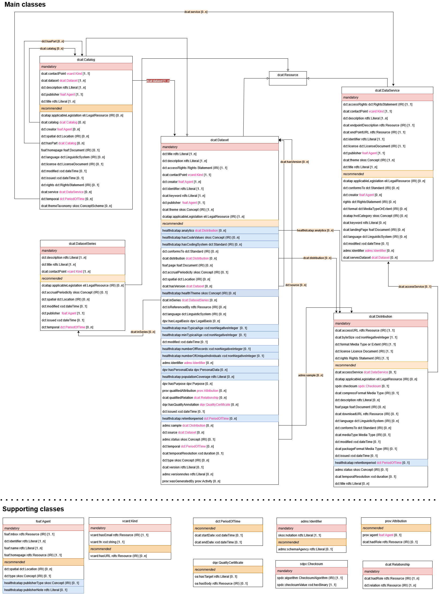

# Core Metadata Schema Specification
This is a pre-release version of Health-RI metadata schema 2.0. 

## Latest published version
Latest published version (version 1.0.0) [available here](https://github.com/Health-RI/health-ri-metadata/releases/tag/v1.0.0).

## Purpose and audience

This branch contains the 2nd version of the Health-RI core and generic health metadata schema for the National Health Data Catalogue, detailing the classes and entities involved and offering usage notes for developers. It addresses the schema's design and application but excludes discussion on the National Health Data Catalogue and its onboarding process (these are described [here](https://health-ri.atlassian.net/wiki/spaces/FSD/pages/279150593/Metadata+onboarding+on+the+National+Catalogue)). **Please note that we are currently still working on the implementation of the new schema into the National Health Data Catalogue.** 

This documentation aims at a **technical audience** tasked with implementing the metadata schema and stakeholders interested in a detailed understanding of the core metadata schema. With any further questions or comments please contact Health-RI via the [Health-RI Servicedesk](https://www.health-ri.nl/health-ri-servicedesk) or via [servicedesk@health-ri.nl](mailto:servicedesk@health-ri.nl) 

* [Introduction](#introduction)
    * [Scope](#scope)
    * [Mandatory and Recommended](#mandatory-and-recommended)
    * [Used Prefixes](#used-prefixes)
    * [Overview and Diagram](#overview-and-diagram)
* [Main Classes](#main-classes)
    * [Mandatory Classes](#mandatory-classes)
    * [Recommended Classes](#recommended-classes)
* [Main Properties per Class](#main-properties-per-class)
    * [Catalog](#catalog)
    * [Dataset](#dataset)
    * [Dataset Series](#dataset-series)
    * [Data Service](#data-service)
    * [Distribution](#distribution)
    * [Project](#project)
    * [Study](#study)
    * [Agent](#agent)
    * [Kind](#kind)
    * [Checksum](#checksum)
    * [Period of time](#period-of-time)
* [Further Information](#further-information)
    * [Model extension](#model-extension)

## Introduction

### Scope and current state of the Health-RI core metadata schema

Building on the [1st version of the metadata schema](https://github.com/Health-RI/health-ri-metadata/tree/master), the scope of the plateau 2 version is to incorporate both [DCAT-AP NL](https://geonovum.github.io/DCAT-AP-NL30/) and the (yet to be finalized) [HealthDCAT-AP](https://healthdcat-ap.github.io/), as well as Health-RI specific requirements / needs for the [National Health Data Catalogue](https://catalogus.healthdata.nl/). It introduces several health-related properties (indicated in blue in the UML diagram below), with (where applicable) suggested or required controlled vocabularies.

Please note that HealthDCAT-AP has currently not officially been finalized and is subject to change and further specification. Once the official release is published, we will reevaluate and make the Health-RI schema compatible with HealthDCAT-AP. The current version of the model is based on the HealthDCAT-AP draft, version of 16-12-2024. In that version, cardinalities of HealthDCAT-AP are dependent for different access rights (public, restricted, non-public). It was decided to be compliant to the [open](https://healthdcat-ap.github.io/OPEN%20DATA%20HealthDCAT-AP%203.0.0.drawio.png) version for now, and cardinalities from that UML diagram of the HealthDCAT-AP specification were used as a reference for compliance checking. 

In addition, several **ELSI**-related metadata fields, as [gathered](https://health-ri.atlassian.net/wiki/spaces/HA/pages/469893133/Metadata+rondom+gebruiksvoorwaarden+en+authenticatie+autorisatie+en+ELSI+aspecten#Catalogus) by the Health-RI ELSI team, are included in this draft version, although not mandatory. The use of these properties will be explored and evaluated once the new version is implemented in the catalogue. 

Next to that, the [**Project**](#project) and [**Study**](#study) classes are introduced, but still contain minimal properties. The proposed properties, cardinalities and ranges are a starting point, and your input on these two classes is very welcome! If you would like to join the discussions on these two classes, feel free to [contact us](mailto:servicedesk@health-ri.nl).

Finally, the newly introduced property `data origin` (in grey in the UML), with the goal to discriminate non-synthetic from synthetic data, is included in the draft. We now propose to further indicate the **nature of the data** (eg. Whole genome sequencing data, or questionnaire data) with `healthdcatap:healthTheme`. 

Several classes have been included from [DCAT-AP NL](https://docs.geostandaarden.nl/dcat/dcat-ap-nl30/) and [HealthDCAT-AP](https://healthdcat-ap.github.io/) without further specification so far at Health-RI. This includes the [DataService class](#data-service). Therefore, these classes can be used, but are not yet further modelled to reflect specific needs of dataholders for the National Health Data Catalogue. 

### Mandatory and Recommended

In the version 2 of the schema, we extended the [current version](https://github.com/Health-RI/health-ri-metadata/releases/tag/v1.0.0), which is based on the [DCAT-AP 3.0](https://semiceu.github.io/DCAT-AP/releases/3.0.0/) specification, by adding new properties from [HealthDCAT-AP](https://healthdcat-ap.github.io/) and [DCAT-AP NL](https://docs.geostandaarden.nl/dcat/dcat-ap-nl30/), as well as changing cardinalities in order to make it compatible with both extensions.
Please note that [HealthDCAT-AP](https://healthdcat-ap.github.io/) is still in its draft version, so we made some properties less strict than what it currently specifies. In the HRI schema, we categorize components into `mandatory` and `recommended` classes and properties. A potential third category, `optional`, may be introduced in the future.

In the context of data exchange:

*   **Mandatory** `Class`: Senders **MUST** provide information about instances of the class; Receivers MUST process information about instances of the class.
    
*   **Recommended** `Class`: Senders **SHOULD** provide information about instances of the class if available; Receivers MUST process information about instances of the class.
    
*   **Optional** `Class`: Senders **MAY** provide the information but are not obliged to do so; Receivers MUST process information about instances of the class.
    
*   **Mandatory** `property`: Senders MUST provide the information for that property; Receivers MUST process the information for that property.
    
*   **Recommended** `property`: Senders SHOULD provide the information if available; Receivers MUST process the information for that property.
    
*   **Optional** `property`: Senders MAY provide the information but are not obliged to do so; Receivers MUST process the information for that property.

### Used Prefixes

| **Prefix** | **Namespace IRI** | 
| --- | --- | 
| `adms` | `http://www.w3.org/ns/adms#` | 
| `dcat` | `http://www.w3.org/ns/dcat#` | 
| `dcatap` | `http://data.europa.eu/r5r/` | 
| `dct` | `http://purl.org/dc/terms/` | 
| `dpv` | `https://w3id.org/dpv#` | 
| `dpv-pd` | `https://w3id.org/dpv/dpv-pd#` | 
| `dqv` | `https://www.w3.org/TR/vocab-dqv/` |
| `foaf` | `http://xmlns.com/foaf/0.1/` | 
| `owl` | `http://www.w3.org/2002/07/owl#` | 
| `rdf` | `http://www.w3.org/1999/02/22-rdf-syntax-ns#` | 
| `rdfs` | `http://www.w3.org/2000/01/rdf-schema#` | 
| `skos` | `http://www.w3.org/2004/02/skos/core#` | 
| `spdx` | `http://spdx.org/rdf/terms#` | 
| `time` | `http://www.w3.org/2006/time#` | 
| `xsd` | `http://www.w3.org/2001/XMLSchema#` | 
| `vcard` | `http://www.w3.org/2006/vcard/ns#` | 
| `healthdcatap` | TBD | 

### Overview and Diagram

An overview of the Metadata schema core is presented in the UML diagram depicted below. The UML showcases the primary classes (entities), excluding the detailed definitions such as rdfs:label and rdfs:comment. Each block denotes a class and comprises a list of its attributes (properties). Where properties connect to another class (the range of the property is another class), this range is stated in pink font. 
If a class is connected to another class by a closed arrow, this indicates that it inherits all properties from the other class. For example, `dcat:DatasetSeries` inherits from `dcat:Dataset` which inherits from `dcat:Resource`. The other arrows, represent relations and contain the type of relation, such as `dcat:Dataset` connects to a `dcat:DatasetSeries` via the predicate `dcat:inSeries`, and include the cardinality, such as `dcat:Dataset` can be connected via `dcat:inSeries` to zero or more `dcat:DatasetSeries`. Mandatory relationships are marked with dark labels, recommended relationships with a lighter colour. 
In the UML, we have separated the main classes from supporting classes. Relationships between main classes are indicated with arrows as described above. Relationships with supporting classes are not shown with arrows to keep a better overview in the drawing, but can still be deduced from the pink coloured ranges of the listed properties per class. 

Next to the UML, a tabular overview of all classes and properties, including their range, cardinality, controlled vocabulary (if applicable) and usage note is findable below. The same information can be referred to in [this sheet](Documents/Pre-release_metadata_CoreGenericHealth_p2.xlsx). In this sheet, we also state the origin of the (new) constrain (DCAT-AP v3, DCAT-AP NL or HealthDCAT-AP). 

- HRI core metadata schema diagram (plateau 2):

**Some notes on using the metadata schema / mapping**: 

- It is possible that not all classes of the metadata schema are necessary to describe your data or the structure of your data. For example, [DataService](#data-service) or [DatasetSeries](#dataset-series) might not apply to all datasets described/onboarded in the National Health Data Catalogue 

- The power of [DCAT](https://www.w3.org/TR/vocab-dcat-3/) is that it is flexible in use, giving a data holder the ability to reflect the structure of their data by using the different classes. 

- To improve this even further, we have now introduced [Project](#project) and [Study](#study) classes. 

- Some properties that are present in multiple classes (eg. `dct:publisher`, `dct:creator`, `dct:contactPoint`) refer to other, small classes (e.g. [foaf:Agent](#agent), [vcard:Kind](#kind)). When used, these properties will instantiate new instances of these classes for each usage. This means, that for example the `dct:publisher` and `dct:creator` can instantiate [foaf:Agent](#agent) at two separate times with different content (organization vs. person). This applies to: [foaf:Agent](#agent), [vcard:Kind](#kind), [spdx:Checksum](#checksum) and [dct:PeriodOfTime](#period-of-time). 

- We collect and share mapping examples from differen data sources [here](https://health-ri.atlassian.net/wiki/spaces/FSD/folder/736985095). 

## Main Classes

### Mandatory Classes
   
| **Class name** | **Definition** | **Usage Note** | **URI** |
| --- | --- | --- | --- | 
| [Dataset](#dataset) | A resource type.  A meaningful collection of data, published or curated by a single organisation or individual, and available for access or download in one or more representations. | When focusing on health data, a dataset typically contains structured information gathered from a study or research project related to health topics. This might include clinical trial results, public health statistics, patient records, survey data, etc. How the data in a dataset can be accessed is defined in the Distribution, which usually points to the actual data files available for access or download. Datasets are often included in a catalog, which organizes and provides metadata about multiple datasets, making them easier to find and use. The term 'organization or individual' refers to any entity responsible for creating, maintaining, or distributing the dataset. | `dcat:Dataset` |
| [Catalog](#catalog) | A catalog that is listed in the National Health Data catalog and contains one or several datasets and/or data services. | Used to describe a bundle of datasets (and other resources) under a single title, for example a collection. | `dcat:Catalog` |
| [Agent](#agent) | An entity that is associated with catalog and/or Datasets. | A person or organization that is associated with the catalogue, dataset or project. This class is instantiated in these classes, whenever the range is foaf:Agent. | `foaf:Agent` |
| [Kind](#kind) | A description following the vCard specification to provide contact information. | Used to describe contact information for Dataset and DatasetSeries. This class is instantiated in these classes, whenever the range is vcard:Kind. | `vcard:Kind` | 

### Recommended Classes

| **Class name** | **Definition** | **Usage Note** | **URI** |
| --- | --- | --- | --- |   
| [Distribution](#distribution) | An available distribution of the dataset. | Used to describe the different ways that a single dataset can be made available in. I.e., it can be downloaded or it can be accessed online in one or more distributions (e.g. one in a downloadable .csv file, another file with an access or query webpage) | `dcat:Distribution` |
| [Dataset Series](#dataset-series) | A collection of datasets that are published separately, but share some characteristics that group them. | A Dataset Series is a collection of similar datasets that are somehow interrelated but published separately. An example is consecutive datasets split by year and or datasets seperated by location. Instead of being made available in a single dataset, the individual (eg. yearly) datasets are linked together with the Dataset Series class. | `dcat:DatasetSeries` |
| [Data Service](#data-service) | A Resource type.   A collection of operations that provides access to one or more datasets or data processing functions. | A Data service offers the possibility to access and query the data of one (or several datasets) through operations. If offers more extensive possibilities to access the data than the Distribution through a variety of potential actions. An example of a Data Service is a [Beacon API](https://docs.genomebeacons.org/) to query genomics data. | `dcat:DataService` |
| [Project](#project) | A collective endeavour of some kind. The Project class represents the class of things that are 'projects'. These may be formal or informal, collective or individual. | This class can be used to describe organizational aspects of a (research or other) funded project, in which one or multiple studies are executed that result in the generation of one or multiple datasets. Next to an overall description of the project, it includes information about the funding agent(s). | `foaf:Project` |
| [Study](#study) | A Study represents the process by which a data set was generated or collected. | Used to describe the information of a study that generates or collects data described in a dataset. A study is connected to one project. Furthermore, a study can generate one or multiple datasets. | `disco:Study` |
| [Period of Time](#period-of-time) | An interval of time that is named or defined by its start and end dates. This class is instantiated by properties in other classes that have the range `dct:PeriodOfTime`. | TBD | `dct:PeriodOfTime` |
| [Checksum](#checksum) | A value that allows the contents of a file to be authenticated. This class allows the results of a variety of checksum and cryptographic message digest algorithms to be represented. This class is instantiated by properties in other classes that have the range `spdx:Checksum`.  | TBD | `spdx:Checksum` |

## Main Properties per Class

### [Catalog](https://www.w3.org/TR/vocab-dcat-3/#Class:Catalog)

A catalog that is listed in the National Health Data catalog and contains one or several datasets and/or data services. 

#### Mandatory Properties
   
| **Property name** | **Definition** | **URI** | **rdfs:Range** | **Usage Note** | **Cardinality** | **Example** |
| --- | --- | --- | --- | --- | --- | --- |  
| [contact point](https://www.w3.org/TR/vocab-dcat-3/#Property:resource_contact_point) | Relevant contact information for the Catalogue. | `dcat:contactPoint` | `vcard:Kind` | A contact point is someone who can answer questions about the catalogue. Additional properties for the contact point can be found in Class:kind. Example: Data Manager/Steward | 1 | TBD |
| [dataset](https://www.w3.org/TR/vocab-dcat-3/#Property:catalog_dataset) | relates every catalog to its containing datasets. | `dcat:dataset` | `dcat:Dataset` | Each catalog contains one or more datasets. This property serves to link datasets to a catalogue. Therefore, a dataset is always contained inside a catalogue. | 1..\* | TBD |
| [description](http://purl.org/dc/terms/description) | A free-text account of the record. | `dct:description` | `rdfs:Literal` | Briefly describe the datasets in the catalog. You can repeat this in multiple languages. Tip: Use the abstract from your Data Management Plan (DMP) if available. | 1..\* | This catalogue describes the core metadata of AUMC Inflammatory Bowel Disease datasets or   This catalogue describes breast cancer imaging, clinical and omics datasets. |
| [publisher](http://purl.org/dc/terms/publisher) | An entity (organisation) responsible for making the Catalogue available. | `dct:publisher` | `foaf:Agent` | The organisation or individual that is holder of the intellectual property rights of a dataset. For more details about the publisher, see the class Agent. | 1 | name: Radboud University Medical Center   identifier: https://ror.org/05wg1m734   (see class foaf: Agent) |
| [title](http://purl.org/dc/terms/title) | A name given to the Catalogue. | `dct:title` | `rdfs:Literal` | Provide a unique title for your catalog, which can be repeated in multiple languages. | 1..\* | Healthy Brain Study |

#### Recommended Properties
    
| **Property name** | **Definition** | **URI** | **rdfs:Range** | **Usage Note** | **Cardinality** |
| --- | --- | --- | --- | --- | --- |
| [applicable legislation](https://semiceu.github.io/DCAT-AP/r5r/releases/3.0.0/#applicableLegislation) | The legislation that mandates the creation or management of the Catalog. | `dcatap:applicableLegislation` | `eli:LegalResource` | TBD | 0..\* |
| [catalog](https://www.w3.org/TR/vocab-dcat-3/#Property:catalog_catalog) | A catalog that is listed in the catalog. | `dcat:catalog` | `dcat:Catalog` | For certain research projects, multiple catalogs may need to be organized in a nested manner. This property serves to connect the different catalogs with each other.  | 0..\* |
| [creator](https://www.dublincore.org/specifications/dublin-core/dcmi-terms/#creator) | An entity responsible for the creation of the catalogue. | `dct:creator` | `foaf:Agent` | TBD  | 0..\* |
| [geographical coverage](http://purl.org/dc/terms/spatial) | A geographical area covered by the Catalogue. | `dct:spatial` | `dct:Location` | The EU Vocabularies Name Authority Lists must be used for [continents](https://publications.europa.eu/resource/authority/continent), [countries](https://publications.europa.eu/resource/authority/country) and [places](https://publications.europa.eu/resource/authority/place) that are in those lists; if a particular location is not in one of the mentioned Named Authority Lists, [Geonames](https://www.geonames.org/) URIs must be used. For districts or neighbourhoods in NL, [the Dutch vocab](https://vocabs.cbs.nl/nl/) can be used.  | 0..\* |
| [has part](http://purl.org/dc/terms/hasPart) | A related Catalogue that is part of the described Catalogue. | `dct:hasPart` | `dcat:Catalog` | TBD  | 0..\* |
| [home page](http://xmlns.com/foaf/spec/#term_homepage) | A web page that acts as the main page for the Catalogue. | `foaf:homepage` | `foaf:Document` | Could be a page describing the catalogue, incl. link to catalogue.  | 0..1 |
| [language](http://purl.org/dc/terms/language) | A language used in the textual metadata describing titles, descriptions, etc. of the Datasets in the Catalogue. | `dct:language` | `dct:LinguisticSystem` | The use of the [EU Vocabularies Name Authority List for language](http://publications.europa.eu/resource/authority/language) must be used for this property.  | 0..\* |
| [licence](http://purl.org/dc/terms/license) | A licence under which the Catalogue can be used or reused. | `dct:license` | `dct:LicenseDocument` | For public data, use a Creative Commons (CC) license (see [Geonovum options](https://definities.geostandaarden.nl/dcat-ap-nl/nl/)). For most National Health Data Catalogue data services, where data is not public, use the 'not open' license from Geonovum and specify data reuse agreements in the dct:rights property. | 0..1 |
| [modification date](http://purl.org/dc/terms/modified) | The most recent date on which the Catalogue was modified. | `dct:modified` | `xsd:dateTime` | TBD  | 0..1 |
| [record](https://www.w3.org/ns/dcat#record) | A Catalogue Record that is part of the Catalogue. | `dcat:record` | `dcat:CatalogRecord` | NA  | 0..\* |
| [release date](http://purl.org/dc/terms/issued) | The date of formal issuance (e.g., publication) of the Catalogue. | `dct:issued` | `xsd:dateTime` | TBD  | 0..1 |
| [rights](http://purl.org/dc/terms/rights) | A statement that specifies rights associated with the Catalogue. | `dct:rights` | `dct:RightsStatement` | TBD  | 0..1 |
| [service](https://www.w3.org/TR/vocab-dcat-3/#Property:catalog_service) | A service that is listed in the catalog. | `dcat:service` | `dcat:DataService` | Some datasets may have real-time Data Services (e.g., Beacon API counting individuals). IT teams should define the relationship between the catalog and the Data Service via this property. While crucial for interoperability, this property is not relevant for end-users to collect.  | 0..\* |
| [temporal coverage](http://purl.org/dc/terms/temporal) | A temporal period that the Catalogue covers. | `dct:temporal` | `dct:PeriodOfTime` | TBD  | 0..\* |
| [themes](https://www.w3.org/ns/dcat#themeTaxonomy) | A knowledge organisation system used to classify the Catalogue's Datasets. | `dcat:themeTaxanomy` | `skos:ConceptScheme` | This property refers to a knowledge organisation system used to classify the Catalogue's Datasets. It must have at least the value `NAL:data-theme` as this is the mandatory controlled vocabulary for dcat:theme.  | 0..\* |

### [Dataset](https://www.w3.org/TR/vocab-dcat-3/#Class:Dataset)

A meaningful collection of data, published or curated by a single organisation or individual, and available for access or download in one or more representations.

#### Mandatory Properties
 
| **Property name** | **Definition** | **URI** | **rdfs:Range** | **Usage Note** | **Cardinality** | **Example** |
| --- | --- | --- | --- | --- | --- | --- | 
| [access rights](http://purl.org/dc/terms/accessRights) | Information that indicates whether the Dataset is publicly accessible, has access restrictions or is not public. | `dct:accessRights` | [Rights Statement (IRI)](http://publications.europa.eu/resource/authority/access-right) | Information that indicates whether the Dataset is publicly accessible, has access restrictions or is not public. It is foreseen that one of the three options have to be used: public, restricted, non-public. *Public*: Publicly accessible by everyone. Usage note: Permissible obstacles include registration and request for API keys, as long as anyone can request such registration and/or API keys. *Restricted*: Only available under certain conditions. Usage note: This category may include resources that require payment, resources shared under non-disclosure agreements, resources for which the publisher or owner has not yet decided if they can be publicly released. *Non-public*: Not publicly accessible for privacy, security or other reasons. Usage note: This category may include resources that contain sensitive or personal information. | 1 | `http://publications.europa.eu/resource/authority/access-right/RESTRICTED` |
| [contact point](https://www.w3.org/TR/vocab-dcat-3/#Property:resource_contact_point) | Contact information that can be used for sending comments about the Dataset. | `dcat:contactPoint` | `vcard:Kind` | A contact point is someone who can answer questions about the dataset. Additional properties for the contact point can be found in the class vcard:Kind. Example: Data Manager/Steward | 1 | mailto: data-access-committee@xumc.nl   with name Data Access Committee of the x UMC (see vcard:Kind) |
| [creator](http://purl.org/dc/terms/creator) | The entity responsible for producing the dataset. | `dct:creator` | `foaf:Agent` | This property points to a person (known as Agent) responsible for the generation of the dataset. Tipically, this takes the form of the PI involved in the project. | 1..\* | Jip Fictief, Inez Maginary, Fabio Abricated for name of foaf:Agent |
| [description](http://purl.org/dc/terms/description) | A free-text account of the Dataset. | `dct:description` | `rdfs:Literal` | Briefly describe the datasets in the catalog. You can repeat this in multiple languages.  | 1..\* | Collection of physiological data of Healthy Brain Study participants. This collection includes measurements via biowearables for heart rate, oxygenation, systolic and diastolic measures and stress levels. |
| [identifier](http://purl.org/dc/terms/identifier) | The main identifier for the Dataset, e.g. the URI or other unique identifier in the context of the Catalogue. | `dct:identifier` | `rdfs:Literal` | Current status: Health-RI is currently working on a strategy for persistant identifiers for, among other things, datasets. Until a solid solution has been found, we propose the following temporary solution: If your data is published in a repository, fill in with the provided DOI (Example: 10.5281/zenodo.10782800). If not, use the identifier of the dataset as generated in the FAIR data point (FDP). Ensure that metadata is updated if your situation changes. | 1 | https://doi.org/10.34894/ZLOYOJ |
| [keyword](https://www.w3.org/ns/dcat#keyword) | A keyword or tag describing the Dataset. | `dcat:keyword` | `rdfs:Literal` | Add keywords to increase dataset discoverability. Like the description and title, you can add keywords in different languages. Submit each keyword as a separate instance. | 1..\* | Physiological measures, Heart Rate, Stress Measures |
| [publisher](http://purl.org/dc/terms/publisher) | An entity (organisation) responsible for making the Dataset available. | `dct:publisher` | `foaf:Agent` | The organisation or individual responsible for making the dataset available. For datasets, this is typically the employer of the data creators. In simpler cases, the dataset publisher may match the catalog publisher. However, in complex research settings, a catalog might include datasets from multiple publishers (eg. a consortium), each operating independently. If that is the case, where possible, include the information of the consortium. Otherwise provide information of additional publishers in dct:creator. For details, see the class Agent. | 1 | Radboud University Medical Center; identifier https://ror.org/05wg1m734 (see foaf: Agent) |
| [theme](https://www.w3.org/TR/vocab-dcat-3/#Property:resource_theme) | A category of the Dataset. | `dcat:theme` | `skos:Concept` | This property should use the [controlled vocabulary](https://publications.europa.eu/resource/authority/data-theme). In the Health Data Catalogue, most datasets will use NAL:data-theme 'HEAL', but additional values from the same vocabulary are allowed. | 1..\* | http://publications.europa.eu/resource/authority/data-theme/HEAL |
| [title](http://purl.org/dc/terms/title) | A name given to the Dataset. | `dct:title` | `rdfs:Literal` | Provide a unique title for your Dataset, which can be repeated in multiple languages. | 1..\* | Healthy Brain Study - Physiological Data |

#### Recommended Properties

| **Property name** | **Definition** | **URI** | **rdfs:Range** | **Usage Note** | **Cardinality** | **Example** |
| --- | --- | --- | --- | --- | --- | --- |
| [analytics](https://healthdcat-ap.github.io/#Dataset.analytics) | An analytics distribution of the dataset. | `healthdcatap:analytics` | `dcat:Distribution` | Publishers are encouraged to provide URLs pointing to document repositories where users can access or request associated resources such as technical reports of the dataset, quality measurements, usability indicators,... Note that HealthDCAT-AP mentions also API endpoints or analytics services, but these would not be Distriutions but rather DatasetServices. | 0..\* | NA |
| [applicable legislation](http://data.europa.eu/r5r/applicableLegislation) | The legislation that mandates the creation or management of the Dataset. | `dcatap:applicableLegislation` | `eli:LegalResource` | The ELI of the EHDS is currently not yet available. We have therefore decided to keep this property recommended for now. | 0..\* | NA |
| [code values](https://healthdcat-ap.github.io/#Dataset.hascodevalues) | Health classifications and their codes associated with the dataset. | `healthdcatap:hasCodeValues` | `skos:Concept` | Inside this property, you can provide the coding system of the dataset in the form of [wikidata](https://www.wikidata.org/wiki/Wikidata) URI (example: https://www.wikidata.org/entity/P494 for ICD-10 ID) and the URI of the value that describes the dataset (example: https://icd.who.int/browse10/2019/en#/Y59.0 for viral vaccines) | 0..\* | https://www.wikidata.org/entity/P494 for ICD-10 ID and https://icd.who.int/browse10/2019/en#/Y59.0 for viral vaccines|
| [coding system](https://healthdcat-ap.github.io/#Dataset.hascodingsystem) | Coding systems in use (ex: ICD-10-CM, DGRs, SNOMED-CT, ...). | `healthdcatap:hasCodingSystem` | `dct:Standard (IRI)` | This property provides informatio on which coding systems are in use inside your dataset. For this, [wikidata](https://www.wikidata.org/wiki/Wikidata) URIs must be used. | 0..\* | https://www.wikidata.org/entity/P494 (ICD-10 ID) |
| [conforms to](http://purl.org/dc/terms/conformsTo) | An implementing rule or other specification. | `dct:conformsTo` | `dct:Standard (IRI)` | If your data conforms to an established standard or specification, use this property to indicate which one. The [wikidata](https://www.wikidata.org/wiki/Wikidata) URI of the specification must be used. | 0..\* | https://www.wikidata.org/wiki/Q19597236 for FHIR |
| [data origin](http://www.ebi.ac.uk/efo/EFO_0022043) | The origin of the data, namely whether it is synthetic or not. | `efo:EFO_0022043` | `xsd:boolean` | The dataset type property indicates whether the dataset is composed of synthetic or non-synthetic data. In order to do it, standardized vocabularies should be used. These vocabularies are still being developed. | 0..1 | NA |
| [distribution](https://www.w3.org/TR/vocab-dcat-3/#Property:dataset_distribution) | An available distribution of the dataset. | `dcat:distribution` | `dcat:Distribution` | Metadata element used as a key link to the class Distribution. | 0..\* | NA |
| [documentation](http://xmlns.com/foaf/spec/#term_page) | A page or document about this Dataset. | `foaf:page` | `foaf:Document (IRI)` | NA | 0..\* | NA |
| [frequency](http://purl.org/dc/terms/accrualPeriodicity) | The frequency at which the Dataset is updated. | `dct:accrualPeriodicity` | `skos:Concept` | A resource from the following authority table must be used: http://publications.europa.eu/resource/authority/frequency | 0..1 | http://publications.europa.eu/resource/authority/frequency/ANNUAL |
| [geographical coverage](http://purl.org/dc/terms/spatial) | A geographic region that is covered by the Dataset. | `dct:spatial` | `dct:Location` | The EU Vocabularies Name Authority Lists must be used for [continents](https://publications.europa.eu/resource/authority/continent/), [countries](https://publications.europa.eu/resource/authority/country) and [places](https://publications.europa.eu/resource/authority/place/) that are in those lists; if a particular location is not in one of the mentioned Named Authority Lists, [Geonames URIs](https://sws.geonames.org/) must be used. For districts or neighbourhoods in NL, the [Dutch vocab](https://vocabs.cbs.nl/nl/) can be used. However, it might in many cases be desirable to keep the geographical coverage broader (eg. indicating that NL is covered), to not expose detailed information of subject's locations. | 0..\* | http://publications.europa.eu/resource/authority/place/NLD_AMS |
| [has version](https://www.w3.org/TR/vocab-dcat-3/#Property:resource_has_version) | A related Dataset that is a version, edition, or adaptation of the described Dataset. | `dcat:hasVersion` | `dcat:Dataset` | NA | 0..\* | NA |
| [health theme](https://healthdcat-ap.github.io/#Dataset.healththeme) | A category of the Dataset or tag describing the Dataset. | `healthdcatap:healthTheme` | `skos:Concept` | This property is a structured way to tag the dataset with different health themes. This could include, for example, the specific disease the dataset is about. More details can be provided, if desirable, in the keywords property. *Current status*: the HealthDCAT-AP working group is currently exploring is other sources (ontologies, thesauri) can be used for this, next to [Wikidata](https://www.wikidata.org/wiki/Wikidata). | 0..\* | https://www.wikidata.org/wiki/Q58624061 |
| [in series](https://www.w3.org/TR/vocab-dcat-3/#Property:dataset_in_series) | A dataset series of which the dataset is part. | `dcat:inSeries` | `dcat:DatasetSeries` | This property points to which Dataset Series the Dataset is part of.  | 0..\* | NA |
| [is referenced by](http://purl.org/dc/terms/isReferencedBy) | A related resource, such as a publication, that references, cites, or otherwise points to the dataset. | `dct:isReferencedBy` | `rdfs:Resource` | NA | 0..\*  | NA |
| [language](http://purl.org/dc/terms/language) | A language of the Dataset. | `dct:language` | `dct:LinguisticSystem` | The language of the Dataset. For this property, the values from the [EU Vocabularies Languages Named Authority List](https://publications.europa.eu/resource/authority/language) must be used. If your Dataset contains multiple languages, this property can be repeated. | 0..\* | http://publications.europa.eu/resource/authority/language/NLD |
| [legal basis](https://healthdcat-ap.github.io/#Dataset.haslegalbasis) | The legal basis used to justify processing of personal data. | `dpv:hasLegalBasis` | `dpv:LegalBasis` | The legal basis can be provided as a value from the [dpv taxonomy](https://w3c.github.io/dpv/2.0/dpv/modules/legal_basis.html). | 0..\* | NA |
| [maximum typical age](https://healthdcat-ap.github.io/#Dataset.maxtypicalage) | Maximum typical age of the population within the dataset. | `healthdcatap:maxTypicalAge` | `xsd:nonNegativeInteger` | The approximate maximum age of subjects in the dataset, if applicable. Approximate age is given to protect potentially sensitive information of subjects in the dataset. | 0..1 | NA |
| [minimum typical age](https://healthdcat-ap.github.io/#Dataset.mintypicalage) | Minimum typical age of the population within the dataset. | `healthdcatap:minTypicalAge` | `xsd:nonNegativeInteger` | The approximate minimum age of subjects in the dataset, if applicable. Approximate age is given to protect potentially sensitive information of subjects in the dataset. | 0..1 | NA |
| [modification date](http://purl.org/dc/terms/modified) | The most recent date on which the Dataset was changed or modified. | `dct:modified` | `xsd:dateTime` | This property indicates changes to the dataset, not the metadata record. An absent value may mean the resource hasn't changed since publication, the modification date is unknown, or the resource is continuously updated. | 0..1 | 2024-06-04T13:36:10.246Z |
| [number of records](https://healthdcat-ap.github.io/#Dataset.numberofrecords) | Size of the dataset in terms of the number of records. | `healthdcatap:numberOfRecords` | `xsd:NonNegativeInteger` | Number of records inside a Dataset. | 0..1 | NA |
| [number of unique individuals](https://healthdcat-ap.github.io/#Dataset.numberofuniqueindividuals) | Number of records for unique individuals. | `healthdcatap:numberOfUniqueIndividuals` | `xsd:NonNegativeInteger` | This property is not mandatory, since not all datasets might include data from individuals. | 0..1 | NA |
| [other identifier](https://healthdcat-ap.github.io/#Dataset.otheridentifier) | A secondary identifier of the Dataset, such as MAST/ADS17, DataCite18, DOI19, EZID20 or W3ID21. | `adms:identifier` | `adms:Identifier` | NA | 0..\* | NA |
| [personal data](https://healthdcat-ap.github.io/#Dataset.haspersonaldata) | Key elements that represent an individual in the dataset. | `dpv:hasPersonalData` | `dpv:PersonalData` | The different types of personal information that are collected in the dataset can be indicated with this property. Values can be picked from the [dpv taxonomy](https://w3c.github.io/dpv/2.0/pd/).  | 0..\* | NA |
| [population coverage](https://healthdcat-ap.github.io/#Dataset.populationcoverage) | A definition of the population within the dataset. | `healthdcatap:populationCoverage` | `rdfs:Literal` | This field is a free text description of the population covered in the dataset. | 0..\* | NA |
| [purpose](https://w3c.github.io/dpv/2.0/dpv/#dfn-haspurpose) | A free text statement of the purpose of the processing of data or personal data. | `dpv:hasPurpose` | `dpv:Purpose` | One (or many) category or sub-category of the purposes can be chosen from the[taxonomy provided by dpv](https://w3c.github.io/dpv/2.0/dpv/#vocab-purposes). | 0..\* | NA |
| [qualified attribution](https://www.w3.org/TR/prov-o/#qualifiedAttribution) | An Agent having some form of responsibility for the resource. | `prov:qualifiedAttribution` | `prov:Attribution` | Current status: the value list for this property is currently being extended. | 0..\* | NA |
| [qualified relation](https://semiceu.github.io/DCAT-AP/releases/3.0.0/#Dataset.qualifiedrelation) | A description of a relationship with another resource. | `dcat:qualifiedRelation` | `dcat:Relationship` | NA | 0..\* | NA |
| [quality annotation](https://www.w3.org/TR/vocab-dqv/#dqv:hasQualityAnnotation) | A statement related to quality of the Dataset, including rating, quality certificate, feedback that can be associated to the dataset. | `dqv:hasQualityAnnotation` | `dqv:qualityCertificate` | NA | 0..\* | NA |
| [release date](http://purl.org/dc/terms/issued) | The date when a dataset becomes officially available. | `dct:issued` | `xsd:dateTime` | This property should use the first known date of issuance, such as the publication date in a data repository. | 0..1 | 2023-12-10T13:16:10.246Z |
| [retention period](https://healthdcat-ap.github.io/#Dataset.retentionperiod) | A temporal period which the dataset is available for secondary use. | `healthdcatap:retentionperiod` | `dct:PeriodOfTime` | This property makes use of the class dct:PeriodOfTime, in which a start and end date should be provided. | 0..1 | NA |
| [sample](https://healthdcat-ap.github.io/#Dataset.sample) | A sample distribution of the dataset. | `adms:sample` | `dcat:Distribution` | NA | 0..\* | NA |
| [source](http://purl.org/dc/terms/source) | A related dataset from which the described dataset is derived. | `dct:source` | `dcat:Dataset` | NA | 0..\* | NA |
| [status](https://www.w3.org/TR/vocab-adms/#adms-status) | The status of a dataset. | `adms:status` | `skos:Concept` | A resource from the authoroty table must be used https://publications.europa.eu/resource/authority/dataset-status | 0..1 | http://publications.europa.eu/resource/authority/dataset-status/COMPLETED |
| [temporal coverage](http://purl.org/dc/terms/temporal) | A temporal period that the Dataset covers. | `dct:temporal` | `dct:PeriodOfTime` | The start and end date of the period that the dataset covers. This property makes use of a small class: Period of Time, in which a start and end date can be given. | 0..\* | NA |
| [temporal resolution](http://purl.org/dc/terms/temporalResolution) | The minimum time period resolvable in the dataset. | `dcat:temporalResolution` | `xsd:duration` | If the dataset is a time-series, this should correspond to the spacing of items in the series. For other kinds of dataset, this property will usually indicate the smallest time difference between items in the dataset. The time period has to be provided in the xsd:duration format. | 0..1 | NA |
| [type](http://purl.org/dc/terms/type) | A type of the Dataset. | `dct:type` | `skos:Concept` | A [recommended controlled vocabulary data-type is foreseen](https://publications.europa.eu/resource/authority/dataset-type). Health datasets with personal information must use 'personal data'. This list supports dataset categorization for the EU Open Data Portal. Currently, 'PERSONAL_DATA' is not included in the EU vocabulary and cannot be filled out. | 0..1 | http://publications.europa.eu/resource/authority/dataset-type/PERSONAL_DATA |
| [version](https://semiceu.github.io/DCAT-AP/releases/3.0.0/#Dataset.version) | The version indicator (name or identifier) of a resource. | `dcat:version` | `rdfs:Literal` | Suggested practice: track major_version.minor_version. Register a new identifier for major changes (e.g., 1.0.0 for an unchanged dataset). | 0..1 | NA |
| [version notes](https://www.w3.org/ns/legacy_adms#versionNotes) | A description of the differences between this version and a previous version of the Dataset. | `adms:versionnotes` | `rdfs:Literal` | Provide a short description of changes made to the dataset from the previous version. | 0..\* | NA |
| [was generated by](https://www.w3.org/TR/prov-o/#wasGeneratedBy) | An activity that generated, or provides the business context for, the creation of the dataset. | `prov:wasGeneratedBy` | `prov:Activity` | NA | 0..\* | NA |
| [was used by](https://www.w3.org/TR/prov-o/#wasUsedBy) | TBD | `prov:wasUsedBy` | `prov:Activity` | NA | 0..\* | NA |

### [Dataset Series](https://www.w3.org/TR/vocab-dcat-3/#Class:Dataset_Series)

A collection of datasets that are published separately, but share some characteristics that group them.

#### Mandatory Properties
 
| **Property name** | **Definition** | **URI** | **rdfs:Range** | **Usage Note** | **Cardinality** |
| --- | --- | --- | --- | --- | --- | 
| [description](http://purl.org/dc/terms/description) | A free-text account of the Dataset Series. | `dct:description` | `rdfs:Literal` | Briefly describe the dataset series in the catalog. You can repeat this in multiple languages.  | 1..\* | 
| [title](http://purl.org/dc/terms/title) |  A name given to the Dataset Series. | `dct:title` | `rdfs:Literal` | Provide a unique title for your Dataset Series, which can be repeated in multiple languages. | 1..\* |

#### Recommended Properties

| **Property name** | **Definition** | **URI** | **rdfs:Range** | **Usage Note** | **Cardinality** |
| --- | --- | --- | --- | --- | --- |
| [applicable legislation](http://data.europa.eu/r5r/applicableLegislation) | The legislation that mandates the creation or management of the Dataset Series. | `dcatap:applicableLegislation` | `eli:LegalResource` | The ELI of the EHDS is currently not yet available. We have therefore decided to keep this property recommended for now. | 0..\* |
| [contact point](https://www.w3.org/TR/vocab-dcat-3/#Property:resource_contact_point) | Contact information that can be used for sending comments about the Dataset Series. | `dcat:contactPoint` | `vcard:Kind` | A contact point is someone who can answer questions about the dataset series. Additional properties for the contact point can be found in Class:kind. Example: Data Manager/Steward | 0..\* |
| [frequency](http://purl.org/dc/terms/accrualPeriodicity) | The frequency at which the Dataset Series is updated. | `dct:accrualPeriodicity` | `skos:Concept` | A resource from the following authority table must be used: http://publications.europa.eu/resource/authority/frequency. The frequency of a dataset series is not equal to the frequency of the dataset in the collection. | 0..1 | 
| [geographical coverage](http://purl.org/dc/terms/spatial) | A geographic region that is covered by the Dataset Series. | `dct:spatial` | `dct:Location` | The EU Vocabularies Name Authority Lists must be used for [continents](https://publications.europa.eu/resource/authority/continent/), [countries](https://publications.europa.eu/resource/authority/country) and [places](https://publications.europa.eu/resource/authority/place/) that are in those lists; if a particular location is not in one of the mentioned Named Authority Lists, [Geonames URIs](https://sws.geonames.org/) must be used. For districts or neighbourhoods in NL, the [Dutch vocab](https://vocabs.cbs.nl/nl/) can be used. However, it might in many cases be desirable to keep the geographical coverage broader (eg. indicating that NL is covered), to not expose detailed information of subject's locations. | 0..\* | 
| [modification date](http://purl.org/dc/terms/modified) | The most recent date on which the Dataset Series was changed or modified. | `dct:modified` | `xsd:dateTime` | This is not equal to the most recent modified dataset in the collection of the dataset series. | 0..1 | 
| [publisher](http://purl.org/dc/terms/publisher) | An entity (organisation) responsible for ensuring the coherency of the Dataset Series. | `dct:publisher` | `foaf:Agent` | The publisher of the dataset series may not be the publisher of all datasets. E.g. a digital archive could take over the publishing of older datasets in the series.  | 0..1 | 
| [release date](http://purl.org/dc/terms/issued) | The date of formal issuance (e.g., publication) of the Dataset Series. | `dct:issued` | `xsd:dateTime` | The moment when the dataset series was established as a managed resource. This is not equal to the release date of the oldest dataset in the collection of the dataset series. | 0..1 | 
| [temporal coverage](http://purl.org/dc/terms/temporal) | A temporal period that the Dataset Series covers. | `dct:temporal` | `dct:PeriodOfTime` | When temporal coverage is a dimension in the dataset series then the temporal coverage of each dataset in the collection should be part of the temporal coverage. In that case, an open ended value is recommended, e.g. after 2012. | 0..\* | 

### [Data Service](http://www.w3.org/ns/dcat#DataService)

A collection of operations that provides access to one or more datasets or data processing functions.

#### Mandatory Properties
  
| **Property name** | **Definition** | **URI** | **rdfs:Range** | **Usage Note** | **Cardinality** | **Example** |
| --- | --- | --- | --- | --- | --- | --- |
| [access rights](http://purl.org/dc/terms/accessRights) | Information regarding access or restrictions based on privacy, security, or other policies. | `dct:accessRights` | [Rights Statement (IRI)](http://publications.europa.eu/resource/authority/access-right) | Information that indicates whether the Dataset is publicly accessible, has access restrictions or is not public. This property is required to adopt one of the predefined values listed in the Access Rights Named Authority List provided by the Publications Office. This designation informs data users whether the dataset is considered open data or is classified as non-public. | 1 | For non-public data, use the value: `http://publications.europa.eu/resource/authority/access-right/NON_PUBLIC` |
| [contact point](https://www.w3.org/TR/vocab-dcat-3/#Property:resource_contact_point) | Contact information that can be used for sending comments about the Data Service. | `dcat:contactPoint` | `vcard:Kind` | A contact point is someone who can answer questions about the data service. Additional properties for the contact point can be found in the class vcard:Kind. Example: Data Manager/Steward | 1 | mailto: data-access-committee@xumc.nl   with name Data Access Committee of the x UMC (see vcard:Kind) |
| [description](http://purl.org/dc/terms/description) | A free-text account of the Data Service. | `dct:description` | `rdfs:Literal` | Briefly describe the data service provided. You can repeat this description in multiple languages. | 1..\* | A data service that provides API access to real-time electrocardiogram (ECG) monitoring data for clinical research applications. |
| [end point description](https://www.w3.org/TR/vocab-dcat-3/#Property:data_service_endpoint_description) | A description of the services available via the end-points, including their operations, parameters etc. | `dcat:endpointDescription` | `rdfs:Literal` | A description of the technical details or documentation for accessing the data service's endpoint. It helps users understand how to interact with the service. | 1 | TBD |
| [end point URL](https://www.w3.org/TR/vocab-dcat-3/#Property:data_service_endpoint_url) | The root location or primary endpoint of the service (a Web-resolvable IRI). | `dcat:endPointURL` | `IRI` | Provide the URL of the endpoint that users can interact with to access the data service. This should be a direct link to the service's endpoint, such as an API URL, SPARQL endpoint, or similar.  | 1 | NA |
| [identifier](http://purl.org/dc/terms/identifier) | A unique identifier of the resource being described or catalogued. | `dct:identifier` | `rdfs:Literal` | Provide a unique identifier for the data service. This could be a globally unique and persistent identifier, such as a DOI, URN, or UUID. If no persistent identifier is available, you may use the accessURL or endpointURL as the identifier, provided it is stable and unique to the service. | 1 | NA |
| [license](http://purl.org/dc/terms/license) | A licence under which the Data service is made available. | `dct:license` | `dct:LicenseDocument` | For public data, use a Creative Commons (CC) license (see [Geonovum options](https://definities.geostandaarden.nl/dcat-ap-nl/nl/)). For most National Health Data Catalogue data services, where data is not public, use the 'not open' license from Geonovum and specify data reuse agreements in the dct:rights property. | 1 | NA |
| [publisher](http://purl.org/dc/terms/publisher) | An entity (organisation) responsible for making the Data Service available. | `dct:publisher` | `foaf:Agent` | The organization or individual responsible for making the data service available. In the context of data services, the publisher is typically the organization that manages or provides access to the service. For details, see the class Agent. | 1 | name: Radboud University Medical Center   identifier: https://ror.org/05wg1m734   (see class foaf: Agent) |
| [theme](https://www.w3.org/TR/vocab-dcat-3/#Property:resource_theme) | A category of the Data Service. | `dcat:theme` | `skos:Concept` | This property should use the [controlled vocabulary](https://publications.europa.eu/resource/authority/data-theme). In the Health Data Catalogue, most data services will use NAL:data-theme 'HEAL', but additional values from the same vocabulary are allowed. | 1..\* | https://publications.europa.eu/resource/authority/data-theme/HEAL |
| [title](http://purl.org/dc/terms/title) | A name given to the Data Service. | `dct:title` | `rdfs:Literal` | NA  | 1..\* | NA |

#### Recommended Properties

| **Property name** | **Definition** | **URI** | **rdfs:Range** | **Usage Note** | **Cardinality** |
| --- | --- | --- | --- | --- | --- |  
| [applicable legislation](https://semiceu.github.io/DCAT-AP/r5r/releases/3.0.0/#applicableLegislation) | The legislation that mandates the creation or management of the Data Service. | `dcatap:applicableLegislation` | `eli:LegalResource` | TBA | 0..\* | NA |
| [application profile](http://purl.org/dc/terms/conformsTo) | An established (technical) standard to which the Data Service conforms. | `dct:conformsTo` | `dct:Standard` | The standards referred here SHOULD describe the Data Service and not the data it serves. The latter is provided by the dataset with which this Data Service is connected. For instance the data service adheres to the OGC WFS API standard, while the associated dataset adheres to the [INSPIRE](https://knowledge-base.inspire.ec.europa.eu/index_en) Address data model.  | 0..\* | 
| [creator](http://purl.org/dc/terms/creator) | The entity responsible for producing the resource. | `dct:creator` | `foaf:Agent` | NA | 0..\* | 
| [format](http://purl.org/dc/terms/format) | The structure that can be returned by querying the endpointURL. | `dct:format` | `dct:MediaType or Extent` | Use the term from the authority table: https://publications.europa.eu/resource/authority/file-type | 0..\* | 
| [HVD Category](https://semiceu.github.io/DCAT-AP/r5r/releases/3.0.0/#hvdCategory) | A data category defined in the High Value Dataset Implementing Regulation. | `dcatap:hvdCategory` | `skos:Concept` | For the possible values consult the regulation at http://data.europa.eu/eli/reg_impl/2023/138/oj. Or consult the controlled vocabulary derived from it. | 0..\* | 
| [keyword](https://www.w3.org/ns/dcat#keyword) | A keyword or tag describing the Data Service. | `dcat:keyword` | `rdfs:Literal` | NA | 0..\* |
| [landing page](https://www.w3.org/TR/vocab-dcat-3/#Property:resource_landing_page) | A web page that provides access to the Data Service and/or additional information. | `dcat:landingPage` | `foaf:Document` | It is intended to point to a landing page at the original data service provider, not to a page on a site of a third party, such as an aggregator. | 0..\* |
| [language](http://purl.org/dc/terms/language) | A language of the Data Service. | `dct:language` | `dct:LinguisticSystem` | Indicates the natural language used in the data service, indicated with a value from the [EU controlled vocabulary](https://publications.europa.eu/resource/authority/language). | 0..\* | 
| [modification date](http://purl.org/dc/terms/modified) | Date on which the data service was changed. | `dct:modified` | `xsd:dateTime` | This property indicates the date of the last changes to the dataset, not the metadata record. An absent value may mean the resource hasn't changed since publication, the modification date is unknown, or the resource is continuously updated. | 0..1 |
| [other identifier](https://docs.geostandaarden.nl/dcat/dcat-ap-nl30/#dataservice-other-identifier) | Any other identifiers in addition to the identifier. | `adms:identifier` | `adms:Identifier` | NA | 0..\* |
| [rights](http://purl.org/dc/terms/rights) | A statement that specifies rights associated with the Data Service. | `dct:rights` | `dct:RightsStatement` | NA  | 0..\* | 
| [serves dataset](https://www.w3.org/TR/vocab-dcat-3/#Property:data_service_serves_dataset) | This property refers to a collection of data that this data service can distribute. | `dcat:servesDataset` | `dcat:Dataset` | This property connects the Data Service class to its corresponding dataset(s), ensuring every data service links to at least one dcat:Dataset. While essential for metadata implementation teams on each node, it’s less relevant for researchers to collect.  | 0..\* |

### [Distribution](http://www.w3.org/ns/dcat#Distribution)

An available distribution of the dataset.

#### Mandatory Properties

| **Property name** | **Definition** | **URI** | **rdfs:Range** | **Usage Note** | **Cardinality** | **Example** |
| --- | --- | --- | --- | --- | --- | --- |  
| [access URL](https://www.w3.org/TR/vocab-dcat-3/#Property:distribution_access_url) | A URL that gives access to a Distribution of the Dataset. | `dcat:accessURL` | `IRI` | Add a link that points to where the dataset can be found. If it’s hosted in a Data Repository, include the link to its entry. For datasets not in a repository (like registries), but still available for secondary use, provide a link to an access request form or a webpage with instructions for accessing the data. | 1 | NA  |
| [byte size](https://semiceu.github.io/DCAT-AP/releases/3.0.0/#Distribution.bytesize) | The size of a Distribution in bytes. | `dcat:byteSize` | `xsd:nonNegativeInteger` | Describes the size of the distribution (the actual file) in bytes, and is therefore expressed as a non-negative integer. If the actual size is not know, it can be estimated.  | 1 | NA  |
| [format](http://purl.org/dc/terms/format) | The file format of the Distribution. | `dct:format` | `dct:MediaType or Extent` | This property can be used to describe a media format in more detail than "media type" (using IANA media type) when needed. Instances of this property should use a URL, e.g., from the [File Type vocabulary](https://publications.europa.eu/resource/authority/file-type). For instance, for mzML files the value of this property could be: http://edamontology.org/format_3244 | 1 | http://publications.europa.eu/resource/authority/file-type/TSV |
| [license](http://purl.org/dc/terms/license) | A licence under which the Distribution is made available. | `dct:license` | `dct:LicenseDocument` | For public data, use a Creative Commons (CC) license (see [Geonovum options](https://definities.geostandaarden.nl/dcat-ap-nl/nl/)). For most National Health Data Catalogue distributions, where data is not public, use the 'not open' license from Geonovum and specify data reuse agreements in the dct:rights property. | 1 | NA  |
| [rights](http://purl.org/dc/terms/rights) | A statement that specifies rights associated with the Distribution. | `dct:rights` | `dct:RightsStatement` | A statement that concerns all rights not addressed in fields License or Access rights. In case of not open data (as specified in the dct:licence property), further agreements regarding data reuse (eg. Data Transfer Agreement, DTA,) should be stated in this property. *Current status*: This recommendation on how to state data transfer/reuse conditions will be pilotted in 2025. | 1 | NA |

#### Recommended Properties

| **Property name** | **Definition** | **URI** | **rdfs:Range** | **Usage Note** | **Cardinality** |  **Example** |
| --- | --- | --- | --- | --- | --- | --- |
| [access service](https://www.w3.org/TR/vocab-dcat-3/#Property:distribution_access_service) | A data service that gives access to the distribution of the dataset | `dcat:accessService` | `dcat:DataService` | This property links the distribution class to the corresponding data service(s). | 0..1 | NA |
| [applicable legislation](https://semiceu.github.io/DCAT-AP/r5r/releases/3.0.0/#applicableLegislation) | The legislation that mandates the creation or management of the Distribution. | `dcatap:applicableLegislation` | `eli:LegalResource` | TBA | 0..\* | NA |
| [checksum](https://spdx.org/rdf/spdx-terms-v2.2/#d4e1930) | A mechanism that can be used to verify that the contents of a distribution have not changed.| `spdx:checksum` | `spdx:Checksum` | The checksum is related to the downloadURL. This property makes use of the spdx:Checksum class, which itself has two properties to indicate checksum algorithm and checksum value (see Checksum class for further details). | 0..1 | NA |
| [compression format](https://semiceu.github.io/DCAT-AP/releases/3.0.0/#Distribution.compressionformat) | The format of the file in which the data is contained in a compressed form, e.g. to reduce the size of the downloadable file. | `dcat:compressFormat` | `dct:MediaType` | It SHOULD be expressed using a media type as defined in the official register of media types managed by [IANA](https://www.iana.org/assignments/media-types/media-types.xhtml). | 0..1 | NA |
| [description](http://purl.org/dc/terms/description) | A free-text account of the distribution. | `dct:description` | `rdfs:Literal` | Provide specific details about the distribution here, complementing the description of the related Dataset. This field can be repeated for different language versions of the description. | 0..\* | NA  |
| [documentation](http://xmlns.com/foaf/spec/#term_page) | A page or document about this Distribution. | `foaf:page` | `foaf:Document (IRI)` | This page can contain additional information about the distribution. | 0..\* | NA |
| [download URL](https://www.w3.org/TR/vocab-dcat-3/#Property:distribution_download_url) | If the dataset is openly accessible and available in a repository, you can directly include a link to the downloadable file here. | `dcat:downloadURL` | `IRI` | NA  | 0..1 | NA |
| [language](http://purl.org/dc/terms/language) | A language used in the Distribution. | `dct:language` | `dct:LinguisticSystem (IRI)` | Indicates the natural language used in the Distribution, indicated with a value from the [EU controlled vocabulary](http://publications.europa.eu/resource/authority/language). Not all distributions might have a language, for example imaging data. | 0..\* | NA |
| [linked schemas](http://purl.org/dc/terms/conformsTo) | This property is used to reference a formal schema or data model that defines the structure, constraints, or semantics of the data contained in a DCAT Distribution. This is useful when the data format (like mzML) has a well-defined structure described in an external document, such as an XML Schema (XSD), an OWL ontology, or a JSON Schema. | `dct:conformsTo` | `dct:Standard (IRI)` | This property SHOULD be used to indicate the model, schema, ontology, view or profile that this representation of a dataset conforms to in a machine-readable form. This is (generally) a complementary concern to the media-type or format. Use a reference to the official publication of the respective schema.  | 0..\* | NA |
| [media type](https://www.w3.org/TR/vocab-dcat-3/#Property:distribution_media_type) | The media type of the distribution as defined by IANA \[[IANA-MEDIA-TYPES](https://www.w3.org/TR/vocab-dcat-3/#bib-iana-media-types)\]. | `dcat:mediaType` | `IRI` | Use the specified vocabularies, prioritizing [IANA media types](https://www.w3.org/TR/vocab-dcat-3/#bib-iana-media-types) whenever possible. If unavailable, consider other ontologies, such as [ZonMw generic terms](https://bioportal.bioontology.org/ontologies/ZONMW-GENERIC/?p=classes&conceptid=http%3A%2F%2Fpurl.org%2Fzonmw%2Fgeneric%2F10105), to descibe the format. If IANA media types do not sufficiently describe the format, use "format" to describe it in more detail. | 0..1 | https://www.iana.org/assignments/media-types/text/csv |
| [modification date](http://purl.org/dc/terms/modified) | The most recent date on which the Distribution was changed or modified. | `dct:modified` | `xsd:dateTime` | NA | 0..1 | NA |
| [packaging format](https://semiceu.github.io/DCAT-AP/releases/3.0.0/#Distribution.packagingformat) | The format of the file in which one or more data files are grouped together, e.g. to enable a set of related files to be downloaded together. | `dcat:packageFormat` | `dct:MediaType` | It SHOULD be expressed using a media type as defined in the official register of media types managed by [IANA](https://www.iana.org/assignments/media-types/media-types.xhtml), if available. | 0..1 | NA |
| [release date](http://purl.org/dc/terms/issued) | The date of formal issuance (e.g., publication) of the Distribution. | `dct:issued` | `xsd:dateTime` | The date the dataset distribution was issued.  | 0..1 | NA |
| [retention period](https://healthdcat-ap.github.io/#Dataset.retentionperiod) | A temporal period in which the distribution is available for secondary use. | `healthdcatap:retentionperiod` | `dct:PeriodOfTime` | This property makes use of the class dct:PeriodOfTime, in which a start and end date should be provided. | 0..\* | NA |
| [status](https://www.w3.org/ns/legacy_adms#status) | The status of the distribution in the context of maturity lifecycle. | `adms:status` | `skos:Concept` | It MUST take one of the values Completed, Deprecated, Under Development, Withdrawn. Use a term from the authority table: https://publications.europa.eu/resource/authority/distribution-status | 0..1 | NA |
| [temporal resolution](https://semiceu.github.io/DCAT-AP/releases/3.0.0/#Distribution.temporalresolution) | The minimum time period resolvable in the dataset distribution.| `dcat:temporalResolution` | `xsd:duration` | If applicable, this property indicates the minimum time period resolvable in the dataset distribution, expressed in xsd:duration format (see for more information [here](https://www.w3schools.com/xml/schema_dtypes_date.asp)) | 0..1 | NA |
| [title](http://purl.org/dc/terms/title) | A name given to the Distribution. | `dct:title` | `rdfs:Literal` | A title given to the distribution. This property can be repeated for providing names in parallel languages. | 0..\* | Data Access Request of Healthy Brain study |

### [Project](http://xmlns.com/foaf/spec/#term_Project)

A collective endeavour of some kind. The Project class represents the class of things that are 'projects'. These may be formal or informal, collective or individual.

#### Mandatory Properties

| **Property name** | **Definition** | **URI** | **rdfs:Range** | **Usage Note** | **Cardinality** |
| --- | --- | --- | --- | --- | --- |   
| [catalogue](https://www.w3.org/ns/dcat#resource) | TBA | `dcat:resource` | `dcat:Catalog` | This property is intended to connect the project to a catalogue of which the project is part of. | 1..\* |
| [description](http://purl.org/dc/terms/description) | A free-text account of the Project. | `dct:description` | `rdfs:Literal` | A free text description of the project. Cardinality 1..n to supply the information in multiple languages, if preferred. | 1..\* |
| [funder](http://xmlns.com/foaf/spec/#term_fundedBy) | The funding agent providing funding for the project | `foaf:fundedBy` | `foaf:Agent` | Use this property to indicate the funding agency/agencies that provide funding for the project. This property uses the class foaf:Agent, which has its own mandatory and recommended properties. In case the project is funded internally, the corresponding institute can be submitted as funding agent. | 1..\* |
| [identifier](http://purl.org/dc/terms/identifier) | A unique identifier of the project. | `dct:identifier` | `rdfs:Literal` | This property is intended for the GrantID of the project. | 1 |
| [title](http://purl.org/dc/terms/title) | A title of the project. | `dct:title` | `rdfs:Literal` | Indicate the title of the project here. The title can be supplied in multiple languages if preferred; this is why the cardinality is set to 1..n. | 1..\* |

#### Recommended Properties

| **Property name** | **Definition** | **URI** | **rdfs:Range** | **Usage Note** | **Cardinality** |
| --- | --- | --- | --- | --- | --- | 
| [study](http://purl.org/dc/terms/hasPart) | A study that is performed in the context of the project. | `dct:hasPart` | `disco:Study` | As the study class is used to give more information about data generation or collection, the different data collection endeavors of the project can be stated by instantiating one or several instances of the study class. This property links a project to its study/studies. | 0..\* |

### [Study](https://rdf-vocabulary.ddialliance.org/discovery.html#dfn-disco-study)

A Study represents the process by which a data set was generated or collected. 

#### Mandatory Properties

| **Property name** | **Definition** | **URI** | **rdfs:Range** | **Usage Note** | **Cardinality** |
| --- | --- | --- | --- | --- | --- |   
| [dataset](https://www.w3.org/TR/prov-o/#generated) | The dataset that was generated as a result of this study. | `prov:generated` | `dcat:Dataset` | This property links the study class to the corresponding dataset(s). Therefore, every study must be connected to at least one dcat:Dataset. | 1..\* |
| [description](http://purl.org/dc/terms/description) | A free text desription of the study. | `dct:description` | `rdfs:Literal` | This description should include information about data generation or collection that has resulted in the dataset(s). Thus, it differs from the description in the project class, and should be more specific to the data generation/collection. | 1..\* |
| [identifier](http://purl.org/dc/terms/identifier) | A unique identifier of the study. | `dct:identifier` | `rdfs:Literal` | This property should contain the persistent identifier of the Study. If the persistent identifier is not yet available, generate your own (e.g., exampleIS001). *Ensure that metadata is updated if your situation changes*. | 1 |
| [project](https://www.dublincore.org/specifications/dublin-core/dcmi-terms/#isPartOf) | The project of which this study is a part. | `dct:isPartOf` | `foaf:Project` | This property links the study class to the project under which the study falls. | 1 |
| [title](http://purl.org/dc/terms/title) | The title of the study. | `dct:title` | `rdfs:Literal` | The title of the study (in contrary to the project) should refer to data collection/generation event within a project. | 1..\* |

#### Recommended Properties

There are currently no recommended properties for this class.

### [Agent](http://xmlns.com/foaf/spec/#term_Agent)

An entity that is associated with catalog and/ or dataset. 

#### Mandatory Properties

| **Property name** | **Definition** | **URI** | **rdfs:Range** | **Usage Note** | **Cardinality** |
| --- | --- | --- | --- | --- | --- |   
| [email](http://xmlns.com/foaf/spec/#term_mbox) | A email address via which contact can be made. This property SHOULD be used to provide the email address of the Agent, specified using fully qualified mailto: URI scheme [RFC6068]. The email SHOULD be used to establish a communication channel to the agent. | `foaf:mbox` | `rdfs:Resource` | It is possible to provide the email address of the appropriate institution or department if no personal email address can be provided. | 1 |
| [identifier](http://purl.org/dc/terms/identifier) | A unique identifier of the agent. | `dct:identifier` | `rdfs:Literal` | Specify the entity (person or organization) by providing an identifier. For individuals, use an [ORCID](https://orcid.org) identifier. For organizations, use a [ROR](https://ror.org) identifier. | 1 |
| [name](http://xmlns.com/foaf/spec/#term_name) | A name of the agent. | `foaf:name` | `rdfs:Literal` | This property refers to the given name of the entity. Example: Jane Doe (for a person) and Radboudumc (for an organization). This property can be repeated for different versions of the name (e.g. the name in different languages). | 1..\* |
| [URL](http://xmlns.com/foaf/spec/#term_homepage) | A webpage that either allows to make contact (i.e. a webform) or contains the information how to get into contact. | `foaf:homepage` | `rdfs:Resource` | Provide the URL of the page containing contact information, such as a contact form or details for reaching out. If a specific contact page is unavailable, the main website of the Agent is sufficient. | 1 |

#### Recommended Properties

| **Property name** | **Definition** | **URI** | **rdfs:Range** | **Usage Note** | **Cardinality** |
| --- | --- | --- | --- | --- | --- |   
| [country](http://purl.org/dc/terms/spatial) | Country of the agent. | `dct:spatial` | `dct:Location` | Use the appropriate term from [the EU authority table](https://publications.europa.eu/resource/authority/country). Example for the Netherlands: `http://publications.europa.eu/resource/authority/country/NLD` | 0..\* |
| [publisher note](https://healthdcat-ap.github.io/#Dataset.publishernote) | A property used to provide additional context about a publisher. | `healthdcatap:publishernote` | `rdfs:Literal` | This property can be repeated for parallel language versions of the publisher notes. Example: "Sciensano is a research institute and the national public health institute of Belgium. It is a so-called federal scientific institution that operates under the authority of the federal minister of Public Health and the federal minister of Agriculture of Belgium."@en | 0..1 | NA |
| [publisher type](https://healthdcat-ap.github.io/#Dataset.publishertype) | A category (type) of organisation that makes the Dataset available | `healthdcatap:publishertype` | `skos:Concept` | A [controlled vocabulary](https://raw.githubusercontent.com/SEMICeu/ADMS-AP/master/purl.org/ADMS_SKOS_v1.00.rdf) is provided, denoting commonly recognised health publishers. *Current status*: Specifically for the health domain, a controlled vocabulary is being developed to include commonly recognised health publishers. This vocabulary is currently under development. Version 1.0 includes the following types: Academia-ScientificOrganisation, Company, IndustryConsortium, LocalAuthority, NationalAuthority, NonGovernmentalOrganisation, NonProfitOrganisation, PrivateIndividual, RegionalAuthority, StandardisationBody and SupraNationalAuthority. These should use the following URL: http://purl.org/adms/publishertype/[type]. | 0..1 |
| [type](http://purl.org/dc/terms/type) | A type of the agent that makes the Catalogue or Dataset available. | `dct:type` | `skos:Concept` | Property should be described using [ADMS vocabulary](http://purl.org/adms/publishertype/1.0) | 0..1 |

### [Kind](https://www.w3.org/TR/vcard-rdf/#d4e1819)

A description following the vCard specification to provide contact information. 

#### Mandatory Properties

| **Property name** | **Definition** | **URI** | **rdfs:Range** | **Usage Note** | **Cardinality** |
| --- | --- | --- | --- | --- | --- | 
| [formatted name](https://w3.org/TR/vcard-rdf/#d4e891) | The full name of the contact point. | `vcard:fn` | `xsd:string` | Provide the full name of the contact point, such as the name of a person or department responsible for communication. | 1 |
| [has email](https://www.w3.org/TR/vcard-rdf/#d4e183) | A email address via which contact can be made. | `vcard:hasEmail` | `rdfs:Resource` | "when naming a contact point this information needs to be further specified with additional information, i.e., an email. This email does not need to be a direct contact to the person responsible for the management of the data, could be a generic information email. For example: info@example.com / Jane.doe@example.com | 1 |

#### Recommended Properties

| **Property name** | **Definition** | **URI** | **rdfs:Range** | **Usage Note** | **Cardinality** |
| --- | --- | --- | --- | --- | --- | 
| [contact page](https://www.w3.org/TR/vcard-rdf/#d4e605) | A webpage that either allows to make contact (i.e. a webform) or the information contains how to get into contact. | `vcard:hasURL` | `rdfs:Resource` | Fill this in, if you have a contact form about your resource.  | 0..\* |

### [Checksum](https://spdx.org/rdf/terms/#d4e2091)

A value that allows the contents of a file to be authenticated. This class allows the results of a variety of checksum and cryptographic message digest algorithms to be represented. This class is instantiated by properties in other classes that have the range `spdx:Checksum`. 

#### Mandatory Properties

| **Property name** | **Definition** | **URI** | **rdfs:Range** | **Usage Note** | **Cardinality** |
| --- | --- | --- | --- | --- | --- | 
| [algorithm](https://spdx.org/rdf/terms/#algorithm) | The algorithm used to produce the subject Checksum. | `spdx:algorithm` | `spdx:ChecksumAlgorithm` | Choose one member of the [checksum argorithm members](https://spdx.org/rdf/terms/#d4e2129).  | 1 |
| [checksum value](https://spdx.org/rdf/terms/#checksumValue) | A lower case hexadecimal encoded digest value produced using a specific algorithm. | `spdx:checksumValue` | `xsd:hexBinary` | NA  | 1  |

#### Recommended Properties

There are currently no recommended properties for this class.

### [Period of time](https://semiceu.github.io/DCAT-AP/releases/3.0.0/#Periodoftime)

An interval of time that is named or defined by its start and end dates. This class is instantiated by properties in other classes that have the range `dct:PeriodOfTime`. 

#### Mandatory Properties

There are currently no mandatory properties for this class.

#### Recommended Properties

| **Property name** | **Definition** | **URI** | **rdfs:Range** | **Usage Note** | **Cardinality** |
| --- | --- | --- | --- | --- | --- | 
| [end date](https://semiceu.github.io/DCAT-AP/releases/3.0.0/#Periodoftime.enddate) | The end of the period. | `dcat:endDate` | `xsd:dateTime` | NA  | 0..1  |
| [start date](https://semiceu.github.io/DCAT-AP/releases/3.0.0/#Periodoftime.startdate) | The start of the period. | `dcat:startDate` | `xsd:dateTime` | NA  | 0..1 |

## Further Information

### Model extension

This is a Health-RI core metadata schema, which means it is designed to be “minimal” and cover the basic metadata elements of catalogue resources. If you come from a specific working group or domain and see some of the important elements from your domain should be represented in the metadata, you could build an extension (or so-called petal) of this model for your domain’s specific needs. For more information on this, please check out the [process description for domain-specific metadata](https://health-ri.atlassian.net/wiki/spaces/FSD/pages/545783826/Domain-specific+metadata+schema+development). 
